# CreateYourPizza

A pizza-store **product catalog**: staff maintain simple items, combos, and customizable pizzas; anyone can download a public PDF menu; trusted systems query the same catalog over JWT-protected APIs.

v1 is catalog + public menu + auth. There are **no** orders, carts, payments, or delivery.

## What you get


| Who                | What they can do                                                                                                                    |
| ------------------ | ----------------------------------------------------------------------------------------------------------------------------------- |
| **Admin (staff)**  | Log in with username/password; create, update, and delete products and pizza options; approve or revoke trusted systems; list users |
| **Public**         | `GET /api/menu.pdf` — raw PDF, no login. Optional `?version=` for history                                                           |
| **Trusted system** | Register (pending) → admin approve → API key + secret → `POST /auth/token` → same catalog **read** APIs as admin                    |


**Product rules (v1)**

- **Simple** — fixed-price sellable item
- **Combo** — combination of simples; price is **admin-set**, not the sum of components
- **Pizza** — customizable; shared option catalog (crust size / crust type / toppings), per-option price, `optionsEnabled` flag. Consumer listing types are `simple`, `combo`, `pizza-base`, and `pizza-spec`
- **Veg / non-veg** on all three types

The PDF is headed **Create Your Pizza**, prints version **vN**, and lists sellable name + price. Pizzas with options note **options available**; pizza-spec options sit in their own section. Version bumps **only when a PDF is generated**, not on every write.

## Architecture

Two independent Spring Boot services (no parent POM), each with its own Postgres. Catalog never reads the auth database and never calls `/auth/validate` — it verifies JWTs locally against auth JWKS.

```
                    ┌─────────────────┐
   admin / trusted  │  auth-service   │  :8080
   login / token    │  JWT + JWKS     │──── GET /auth/.well-known/jwks.json
                    │  auth-db :5432  │
                    └────────┬────────┘
                             │ JWKS (HTTP)
                    ┌────────▼────────┐
   catalog CRUD /   │ catalog-service │  :8081
   queries + PDF    │  catalog-db     │  :5433 (host)
                    │  Redis :6379    │  cache, latest menu, locks
                    └─────────────────┘
                             ▲
                    GET /api/menu.pdf  (public, no auth)
```

**Redis** holds the catalog cache (`create-your-pizza/catalog:`*, TTL 3m), the latest menu PDF, and two locks: PDF generation **120s**, catalog write **30s**. Writes while a PDF is generating return **503** with `Retry-After: 60`. If a write is in progress the PDF job **skips** (it is not queued); the dirty flag stays true.

## Entire project view

```mermaid
flowchart TD

subgraph group_auth["Identity and access"]
  node_auth_api["Auth endpoints"]
  node_auth_service["Identity workflows<br/>[AuthService.java]"]
  node_jwt["JWT issuer<br/>[JwtIssuer.java]"]
  node_signing["Signing keys"]
  node_jwks_api["JWKS endpoint"]
end

subgraph group_catalog["Catalog APIs"]
  node_catalog_query["Catalog queries"]
  node_catalog_write["Catalog writes"]
  node_product_query_api["Product query API"]
  node_option_query_api["Option query API"]
  node_product_write_api["Product write API"]
  node_option_write_api["Option write API"]
  node_catalog_auth["JWT verification"]
end

subgraph group_menu["Public menu PDF"]
  node_scheduler["PDF scheduler"]
  node_pdf_generation["PDF generation"]
  node_pdf_renderer["PDF renderer"]
  node_pdf_query_api["Menu PDF API"]
  node_pdf_query["Menu PDF lookup"]
end

subgraph group_state["Persistence and coordination"]
  node_auth_repo["Auth repositories"]
  node_auth_db[("Auth database")]
  node_catalog_db[("Catalog database")]
  node_cache[("Catalog cache")]
  node_redis[("Redis service")]
  node_menu_store["Latest menu store"]
  node_catalog_lock["Catalog locks"]
end

node_admin(("Administrator"))
node_trusted(("Trusted system"))
node_public(("Public visitor"))

node_admin -->|"logs in"| node_auth_api
node_trusted -->|"registers / exchanges"| node_auth_api
node_admin -->|"administers users"| node_auth_api
node_auth_api -->|"dispatches"| node_auth_service
node_auth_service -->|"reads / writes"| node_auth_repo
node_auth_repo -->|"persists"| node_auth_db
node_auth_service -->|"issues tokens"| node_jwt
node_jwt -->|"signs with"| node_signing
node_jwks_api -->|"reads public key"| node_signing
node_jwks_api -->|"publishes keys"| node_trusted
node_admin -->|"maintains catalog"| node_product_write_api
node_admin -->|"maintains options"| node_option_write_api
node_trusted -->|"presents JWT"| node_catalog_auth
node_catalog_auth -.->|"fetches JWKS"| node_jwks_api
node_product_query_api -->|"dispatches"| node_catalog_query
node_option_query_api -->|"dispatches"| node_catalog_query
node_catalog_query -->|"queries catalog"| node_catalog_db
node_catalog_query -->|"reads / writes"| node_cache
node_product_write_api -->|"dispatches"| node_catalog_write
node_option_write_api -->|"dispatches"| node_catalog_write
node_catalog_write -->|"mutates catalog"| node_catalog_db
node_catalog_write -->|"acquires / releases"| node_catalog_lock
node_cache -.->|"stores cache entries"| node_redis
node_catalog_lock -.->|"stores locks"| node_redis
node_scheduler -->|"triggers generation"| node_pdf_generation
node_pdf_generation -->|"reads catalog; saves PDF"| node_catalog_db
node_pdf_generation -->|"renders model"| node_pdf_renderer
node_pdf_generation -->|"updates latest menu"| node_menu_store
node_pdf_generation -->|"coordinates generation"| node_catalog_lock
node_public -->|"requests menu"| node_pdf_query_api
node_pdf_query_api -->|"dispatches"| node_pdf_query
node_pdf_query -->|"checks latest PDF"| node_menu_store
node_pdf_query -->|"reads historical PDF"| node_catalog_db
node_menu_store -.->|"stores latest PDF"| node_redis

click node_auth_api "https://github.com/pererohit/create-your-pizza/blob/main/auth-service/src/main/java/com/createyourpizza/auth/web/AuthController.java"
click node_auth_service "https://github.com/pererohit/create-your-pizza/blob/main/auth-service/src/main/java/com/createyourpizza/auth/service/AuthService.java"
click node_jwt "https://github.com/pererohit/create-your-pizza/blob/main/auth-service/src/main/java/com/createyourpizza/auth/jwt/JwtIssuer.java"
click node_signing "https://github.com/pererohit/create-your-pizza/blob/main/auth-service/src/main/java/com/createyourpizza/auth/jwt/SigningKeyService.java"
click node_jwks_api "https://github.com/pererohit/create-your-pizza/blob/main/auth-service/src/main/java/com/createyourpizza/auth/web/JwksController.java"
click node_auth_repo "https://github.com/pererohit/create-your-pizza/tree/main/auth-service/src/main/java/com/createyourpizza/auth/repository"
click node_catalog_query "https://github.com/pererohit/create-your-pizza/blob/main/catalog-service/src/main/java/com/createyourpizza/catalog/service/CatalogQueryService.java"
click node_catalog_write "https://github.com/pererohit/create-your-pizza/blob/main/catalog-service/src/main/java/com/createyourpizza/catalog/service/CatalogWriteService.java"
click node_product_query_api "https://github.com/pererohit/create-your-pizza/blob/main/catalog-service/src/main/java/com/createyourpizza/catalog/web/ProductQueryController.java"
click node_option_query_api "https://github.com/pererohit/create-your-pizza/blob/main/catalog-service/src/main/java/com/createyourpizza/catalog/web/OptionQueryController.java"
click node_product_write_api "https://github.com/pererohit/create-your-pizza/blob/main/catalog-service/src/main/java/com/createyourpizza/catalog/web/ProductWriteController.java"
click node_option_write_api "https://github.com/pererohit/create-your-pizza/blob/main/catalog-service/src/main/java/com/createyourpizza/catalog/web/OptionWriteController.java"
click node_catalog_auth "https://github.com/pererohit/create-your-pizza/blob/main/catalog-service/src/main/java/com/createyourpizza/catalog/config/CachingRemoteJwkSource.java"
click node_cache "https://github.com/pererohit/create-your-pizza/tree/main/catalog-service/src/main/java/com/createyourpizza/catalog/cache"
click node_scheduler "https://github.com/pererohit/create-your-pizza/blob/main/catalog-service/src/main/java/com/createyourpizza/catalog/service/PdfGenerationScheduler.java"
click node_pdf_generation "https://github.com/pererohit/create-your-pizza/blob/main/catalog-service/src/main/java/com/createyourpizza/catalog/service/PdfGenerationService.java"
click node_pdf_renderer "https://github.com/pererohit/create-your-pizza/blob/main/catalog-service/src/main/java/com/createyourpizza/catalog/pdf/MenuPdfRenderer.java"
click node_pdf_query_api "https://github.com/pererohit/create-your-pizza/blob/main/catalog-service/src/main/java/com/createyourpizza/catalog/web/MenuPdfController.java"
click node_pdf_query "https://github.com/pererohit/create-your-pizza/blob/main/catalog-service/src/main/java/com/createyourpizza/catalog/service/MenuPdfQueryService.java"
click node_menu_store "https://github.com/pererohit/create-your-pizza/blob/main/catalog-service/src/main/java/com/createyourpizza/catalog/menu/LatestMenuStore.java"
click node_catalog_lock "https://github.com/pererohit/create-your-pizza/blob/main/catalog-service/src/main/java/com/createyourpizza/catalog/lock/CatalogLockStore.java"

classDef toneNeutral fill:#f8fafc,stroke:#334155,stroke-width:1.5px,color:#0f172a
classDef toneBlue fill:#dbeafe,stroke:#2563eb,stroke-width:1.5px,color:#172554
classDef toneAmber fill:#fef3c7,stroke:#d97706,stroke-width:1.5px,color:#78350f
classDef toneMint fill:#dcfce7,stroke:#16a34a,stroke-width:1.5px,color:#14532d
classDef toneRose fill:#ffe4e6,stroke:#e11d48,stroke-width:1.5px,color:#881337
classDef toneIndigo fill:#e0e7ff,stroke:#4f46e5,stroke-width:1.5px,color:#312e81
classDef toneTeal fill:#ccfbf1,stroke:#0f766e,stroke-width:1.5px,color:#134e4a
class node_auth_api,node_auth_service,node_jwt,node_signing,node_jwks_api toneBlue
class node_catalog_query,node_catalog_write,node_product_query_api,node_option_query_api,node_product_write_api,node_option_write_api,node_catalog_auth toneAmber
class node_scheduler,node_pdf_generation,node_pdf_renderer,node_pdf_query_api,node_pdf_query toneMint
class node_auth_repo,node_auth_db,node_catalog_db,node_cache,node_redis,node_menu_store,node_catalog_lock toneRose
class node_admin,node_trusted,node_public toneIndigo
```




## Stack

Java **26**, Spring Boot **4.1.1**, Maven (JAR), PostgreSQL 16, Redis 7. Config is `application.properties`. Lombok on both apps.


| Path                 | Role                                                     |
| -------------------- | -------------------------------------------------------- |
| `auth-service/`      | Auth, JWKS, admin and trusted principals — port **8080** |
| `catalog-service/`   | Catalog CRUD/queries, Redis, menu PDF — port **8081**    |
| `docker-compose.yml` | `auth-db`, `catalog-db`, `redis`, both apps              |
| `docs/openapi/`      | Committed static OpenAPI (the integrator contract)       |
| `docs/`              | Spec, design, stories, verify evidence, HIFL process     |


## Run the stack

**Prerequisites:** JDK 26, Maven 3.9+, Docker.

```bash
docker compose up --build
```


| Service           | Host port                 |
| ----------------- | ------------------------- |
| `auth-db`         | `5432`                    |
| `catalog-db`      | `5433` → container `5432` |
| `redis`           | `6379`                    |
| `auth-service`    | `8080`                    |
| `catalog-service` | `8081`                    |


On first start, if no ADMIN exists, **auth-service bootstraps one and prints username + password to stdout**:

```bash
docker compose logs auth-service | grep -i admin
```

Use those credentials with `POST /auth/login`. Add further admins with `POST /auth/admins` (admin JWT).

To run the apps on the host instead, start the three data services (or full Compose) and:

```bash
mvn -f auth-service spring-boot:run
mvn -f catalog-service spring-boot:run
```

Defaults: auth JDBC `localhost:5432/auth`, catalog JDBC `localhost:5433/catalog`, Redis `localhost:6379`, JWKS `http://localhost:8080/auth/.well-known/jwks.json`.

## APIs

There is **no** Swagger UI and **no** live `/v3/api-docs`. Import the committed files into Postman (or any OpenAPI tool) without starting the services:


| Service         | YAML                                                                   | JSON                                                                   |
| --------------- | ---------------------------------------------------------------------- | ---------------------------------------------------------------------- |
| auth-service    | [docs/openapi/auth-service.yaml](docs/openapi/auth-service.yaml)       | [docs/openapi/auth-service.json](docs/openapi/auth-service.json)       |
| catalog-service | [docs/openapi/catalog-service.yaml](docs/openapi/catalog-service.yaml) | [docs/openapi/catalog-service.json](docs/openapi/catalog-service.json) |


After endpoint changes, regenerate with `./scripts/generate-openapi.sh` (Docker; JDK/Maven run in a temporary container) and commit `docs/openapi/*`.

**Auth (high level)**

- `POST /auth/login` — admin username/password → JWT (30-minute TTL)
- `POST /auth/register` → admin approve → API key + secret (once) → `POST /auth/token` → JWT
- `GET /auth/.well-known/jwks.json` — public keys for local verification
- Admins cannot DELETE themselves. Revoking a trusted credential stops **new** tokens; existing JWTs work until `exp`. There is no JWT denylist.

**Catalog (high level)**

- `GET /api/menu.pdf` — public raw PDF; `?version=` for a past generation
- `GET /api/products` — filtered, paginated list (default page size 10, max 100): veg/non-veg, type, price under Rs. X
- `POST` / `PUT` / `DELETE` `/api/products` and `/api/options` — admin JWT; writes during PDF lock → **503** + `Retry-After: 60`


## Tests

```bash
mvn -f auth-service test
mvn -f catalog-service test
```

Suites are mocked (no Compose required). `POST /test/pdf/generate` exists only on the test profile.

## Docs

Product decisions, design, and the integrator contract live under `[docs/](docs/README.md)`. Clone/setup notes for agents: `[AGENTS.md](AGENTS.md)`.