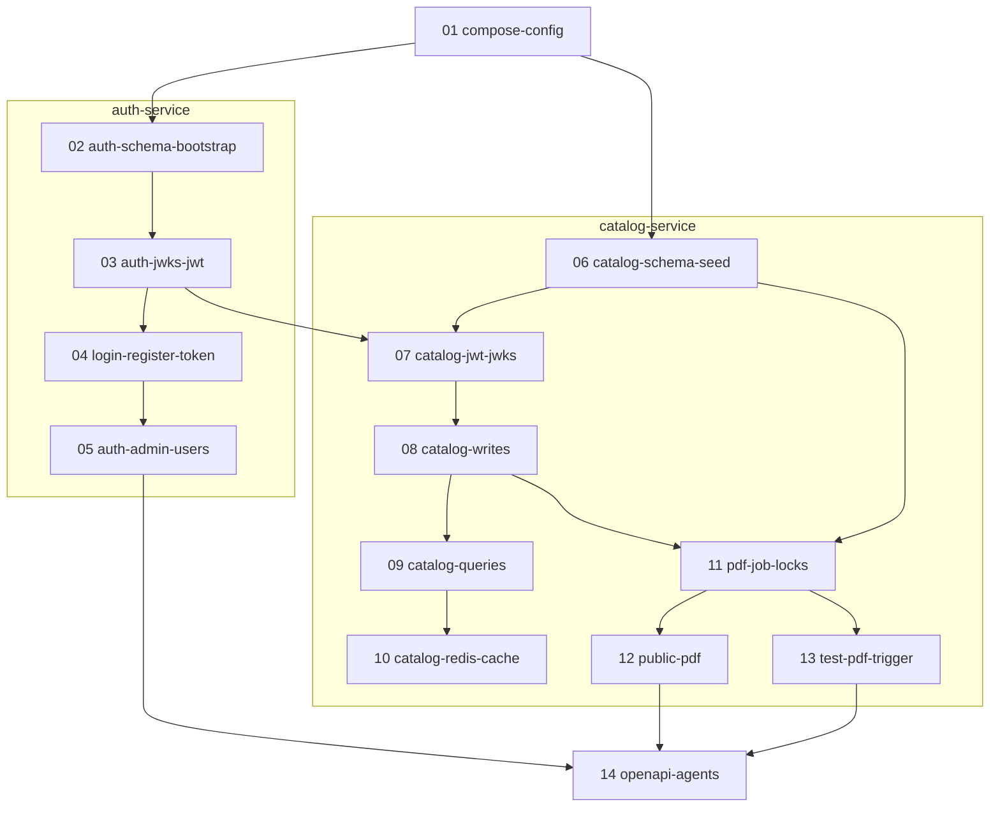

# Build plan — CreateYourPizza

**Status:** APPROVED — 2026-09-18 (owner HIFL Approve). Build-plan gate passed. **Build** is next: stories exist under `docs/stories/`; implement one story at a time (graph in §6).

**Upstream:** [Intent](intent.md) (**APPROVED**) · [Spec / PRD](spec.md) (**APPROVED**) · [Design / TRD](design.md) (**APPROVED**)

**Related:** [Project context](project-context.md) · [HIFL playbook](hifl-playbook.md) · [Handoff](handoff.md) · [Stories](stories/README.md)

**Not in this stage:** Application implementation (that is Stage 5 Build). Stories: [stories/README.md](stories/README.md).

---

## 1. Status and scope

This plan turns APPROVED Design + Spec into an ordered Build: stack, Initializr checklists, Maven layout, story order, tests (mock at ports), Docker, and Definition of Done.

**In scope for Build plan**

- Stack: Spring Boot **4.1.1**, Maven, JAR, Java **26** (Initializr generate as **25**, then pin 26 in both POMs)
- Independent sibling Maven projects under this repo
- Exact Initializr selections + third-party `pom.xml` entries
- Ordered user-story list (files created only after **Approve**)
- Test plan: mock dependent ports (JUnit + Spring Boot Test)
- One root `docker-compose.yml`
- Config in `.properties` files

**Out of scope for Build plan**

- Writing story markdown files (playbook: after Approve)
- Implementing Java, Flyway SQL, or Compose YAML
- Creating `AGENTS.md` or springdoc artifacts (Build stories)

---

## 2. Stack confirmation (locked)

| Item | Choice |
|------|--------|
| Language / build | **Java** + **Maven** |
| Framework | **Spring Boot 4.1.1** |
| Java | Runtime/compile **26**. On start.spring.io choose **25** (26 is not in the dropdown), then set `<java.version>26</java.version>` in **both** `pom.xml` files |
| Packaging | **Jar** |
| Config | `application.properties` (and profile files, e.g. `application-test.properties`) — not YAML |
| Apps | Two **independent** Maven projects (no parent POM) |
| Maven coordinates | **`groupId` `com.createyourpizza`**. Artifacts: **`auth-service`**, **`catalog-service`**. Packages: **`com.createyourpizza.auth`**, **`com.createyourpizza.catalog`**. |
| Auth DB name | **`auth-db`** (v1 engine: PostgreSQL; Flyway in auth-service) |
| Catalog DB name | **`catalog-db`** (v1 engine: PostgreSQL; Flyway in catalog-service) |
| Cache / locks | **Redis** — catalog-service only |
| JWT | **RS256**; catalog **OAuth2 Resource Server** verifies locally from JWKS URL |
| API docs | SpringDoc OpenAPI per service (Initializr) |
| Lombok | **Yes** — both apps |
| Tests | JUnit 5 + Spring Boot Test; **mock ports** (DB, Redis, JWKS HTTP, PDF renderer) |
| Runtime | One **`docker-compose.yml`** at repo root: `auth-db`, `catalog-db`, `redis`, `auth-service`, `catalog-service` |

**JWT identifiers (locked here — Design left them to Build)**

| Claim | Value |
|-------|--------|
| `iss` | `create-your-pizza-auth` |
| `aud` | `create-your-pizza-catalog` |

Catalog rejects tokens that fail `iss` / `aud` / signature / `exp` / required `scope`.

---

## 3. Folder structure and Maven coordinates

Two **sibling** Maven projects. Industry practice for two services in one git repo. One Compose file at the **repo root** is the usual pairing — not harder than separate repos.

```text
create-your-pizza/                          ← git root
  docs/
  docker-compose.yml                        ← whole stack (Build story 01)
  README.md
  AGENTS.md                                 ← after story 14
  auth-service/
    pom.xml                                 ← groupId com.createyourpizza / artifactId auth-service
    src/main/java/com/createyourpizza/auth/
    src/main/resources/application.properties
    src/test/java/com/createyourpizza/auth/
  catalog-service/
    pom.xml                                 ← groupId com.createyourpizza / artifactId catalog-service
    src/main/java/com/createyourpizza/catalog/
    src/main/resources/application.properties
    src/test/java/com/createyourpizza/catalog/
```

On Initializr, set **Package name** explicitly (hyphenated artifact ids otherwise become awkward packages):

| Field | auth-service | catalog-service |
|-------|----------------|-----------------|
| Group | `com.createyourpizza` | `com.createyourpizza` |
| Artifact | `auth-service` | `catalog-service` |
| Name | `auth-service` | `catalog-service` |
| Package name | `com.createyourpizza.auth` | `com.createyourpizza.catalog` |
| Packaging | Jar | Jar |
| Java | **25** | **25** |
| Spring Boot | **4.1.1** | **4.1.1** |

Unzip each zip **into** `auth-service/` and `catalog-service/` (do not nest an extra folder). Coordinates in each `pom.xml`:

`auth-service/pom.xml`:

```xml
<groupId>com.createyourpizza</groupId>
<artifactId>auth-service</artifactId>
<version>0.0.1-SNAPSHOT</version>
<packaging>jar</packaging>
<properties>
  <java.version>26</java.version>
</properties>
```

`catalog-service/pom.xml`:

```xml
<groupId>com.createyourpizza</groupId>
<artifactId>catalog-service</artifactId>
<version>0.0.1-SNAPSHOT</version>
<packaging>jar</packaging>
<properties>
  <java.version>26</java.version>
</properties>
```

Build/run (not difficult):

- `mvn -f auth-service/pom.xml test`
- `mvn -f catalog-service/pom.xml test`
- `docker compose up --build` from `create-your-pizza/`

There is **no** root `pom.xml`. Do not `mvn` at the git root expecting a reactor.

---

## 4. Owner Initializr — exact selections

Do **not** select: Docker Compose Support (root compose is written in-repo), OAuth2 Authorization Server, Spring Session, OAuth2 Resource Server **on auth**.

### 4.1 `auth-service` — select on start.spring.io

| UI name | id |
|---------|-----|
| Spring Web | `web` |
| Spring Security | `security` |
| Spring Data JPA | `data-jpa` |
| PostgreSQL Driver | `postgresql` |
| Flyway Migration | `flyway` |
| Validation | `validation` |
| SpringDoc OpenAPI | `springdoc-openapi` |
| Lombok | `lombok` |

### 4.2 `catalog-service` — select on start.spring.io

| UI name | id |
|---------|-----|
| Spring Web | `web` |
| Spring Security | `security` |
| OAuth2 Resource Server | `oauth2-resource-server` |
| Spring Data JPA | `data-jpa` |
| PostgreSQL Driver | `postgresql` |
| Flyway Migration | `flyway` |
| Spring Data Redis (Access+Driver) | `data-redis` |
| Validation | `validation` |
| SpringDoc OpenAPI | `springdoc-openapi` |
| Lombok | `lombok` |

Catalog Resource Server: JWKS URI in `application.properties` (`AUTH_JWKS_URL` / Spring `spring.security.oauth2.resourceserver.jwt.jwk-set-uri`). That is Design local verify. Auth **issues** JWTs; it is not a resource server.

### 4.3 Third-party libraries — add in that service’s `pom.xml`

Spring Boot parent manages versions for Spring artifacts. Pin `<version>` only when the BOM does not.

| Library | Service | How |
|---------|---------|-----|
| **Nimbus JOSE JWT** | `auth-service` | `<dependency>` `com.nimbusds` / `nimbus-jose-jwt` in `auth-service/pom.xml` (RS256 sign + JWKS JSON). Catalog does **not** add it; Resource Server covers verify. |
| **OpenPDF** | `catalog-service` | `<dependency>` `com.github.librepdf` / `openpdf` in `catalog-service/pom.xml` with an explicit `<version>` (not in the Boot BOM). |

BCrypt comes with Spring Security — no extra dependency.

Install Lombok in the IDE (annotation processing) so generated getters compile.

### 4.4 Agent wait

Until the owner drops both Initializr trees into `auth-service/` and `catalog-service/`, Java stories wait. Story **01** (Compose + properties) can start after Approve before jars exist.

---

## 5. Tests — mock dependents

Story tests use JUnit + Spring Boot Test and **mocks/fakes** at ports. They must not require Docker. Real PostgreSQL and Redis are for `docker compose up` and Stage 6 Verify.

**How:** depend on small ports (interfaces), not on Postgres or Redis types, in application code. Tests supply fakes/mocks.

| Port (illustrative) | Real adapter | In tests |
|---------------------|--------------|----------|
| User / product / option persistence | JPA repositories | Mockito (or in-memory fake) |
| Catalog write / PDF locks | Redis `SET NX EX` adapter | Fake lock map (in-process) |
| Catalog JSON cache | Redis adapter | Fake map + TTL clock if needed |
| JWKS fetch | HTTP client to auth | Stub JWKS JSON / mock `JwtDecoder` |
| PDF bytes | OpenPDF adapter | Fake renderer returning known bytes |

Controllers and use-cases stay testable without a database. Flyway + real PostgreSQL + real Redis are exercised by **`docker compose up`** and Stage 6 Verify — not by every `mvn test`.

---

## 6. Story order (create files after Approve)

Filenames under `docs/stories/`. Implement **one story at a time**. Record the in-progress file in [handoff.md](handoff.md). Rename to `DONE-` when finished. Every **coding** story: **>80% LoC** of that story’s new/changed code **and** full behaviour tests of its acceptance criteria (via mocks/fakes above).

An arrow **A → B** means **B starts only after A is `DONE-`**. After **01**, auth (**02–05**) and catalog schema (**06**) may proceed independently. **07** waits for **both** **03** (JWKS exists) and **06** (catalog schema). After **08**, queries/cache (**09→10**) and PDF (**11→12** and **11→13**) may proceed independently. **14** waits for **05**, **12**, and **13**. Numeric order **01 through 14** is a valid total order if you do not want to interleave.

Owner Initializr for `auth-service` is required before **02**. Owner Initializr for `catalog-service` is required before **06**.



| File | Depends on | Outcome |
|------|------------|---------|
| `01-compose-config.md` | — | Root Compose: `auth-db`, `catalog-db`, `redis`, both apps (stubs OK); volumes; env; **MUST** properties with defaults (PDF 5m, catalog TTL 3m, JWT 30m, lock 120s/30s) |
| `02-auth-schema-bootstrap.md` | 01 + Initializr auth | Flyway `users`, `trusted_client_credentials`, `verification_keys`; startup: if zero `ADMIN` → insert + **stdout** username/password; skip if ≥1 admin |
| `03-auth-jwks-jwt.md` | 02 | RS256 in process; upsert public JWK; `GET /auth/.well-known/jwks.json`; issue JWT with locked claims + `iss`/`aud`/`app.jwt.ttl` |
| `04-auth-login-register-token.md` | 03 | Public `POST /auth/login`, `POST /auth/register` (trusted PENDING only; ignore/400 `role`), `POST /auth/token`; secret hashed; **never** in JWT |
| `05-auth-admin-users.md` | 04 | `POST /auth/admins`; paginated `GET /auth/users` (`role`, `status`, `page`, `size`); approve (secret **once**), deny, revoke; `DELETE` other users; **403 DELETE self** |
| `06-catalog-schema-seed.md` | 01 + Initializr catalog | Flyway products, combo_items, option_entities, menu_pdf, catalog_meta; seed simples/combo/pizza + option entities with **per-row prices** (FR-4a–c); `catalog_meta` dirty=true; **no** first-admin SQL; **no** `system_status` |
| `07-catalog-jwt-jwks.md` | 03, 06 | Resource Server + JWKS URL; startup load; unknown `kid` refetch; **no** auth-db; **no** `/validate`; 401/403 |
| `08-catalog-writes.md` | 07 | Admin CRUD products + options; pizza `optionsEnabled`; combo membership; dirty on success; write lock; if PDF lock → **503** + `Retry-After: 60`; no Redis catalog-key delete; no `menu_pdf` bump on write |
| `09-catalog-queries.md` | 08 | `GET /api/products` union + filters (`category`, `type`, `maxPrice`, `page`/`size` default 10 max 100 clamp); pizza-spec rows; get-by-id product/option; Admin **and** Trusted same reads; Trusted cannot write |
| `10-catalog-redis-cache.md` | 09 | Redis-first `create-your-pizza/catalog:*`; TTL `app.cache.catalog-ttl`; fill on DB hit; **no** invalidation-on-write |
| `11-pdf-job-locks.md` | 08, 06 | Interval job + skip-not-queue; PDF lock 120s; generate header **Create Your Pizza**, **vN**, sellable + **options available** note + options **own space**; insert history; Redis latest JSON; version **only** on successful insert |
| `12-public-pdf.md` | 11 | `GET /api/menu.pdf` raw binary; latest Redis-first; `?version=` history DB (Redis OK if latest); 404 envelope if missing |
| `13-test-pdf-trigger.md` | 11 | `POST /test/pdf/generate` unauthenticated; **test/dev profile only**; same job algorithm |
| `14-openapi-agents.md` | 05, 12, 13 | springdoc both services; `AGENTS.md` (compose, first-admin **logs**, Swagger URLs, JWKS URL) |

Stories 08–13 are catalog-service; 02–05 are auth-service. Do not start **08** before **07**. Do not start a story until every incoming arrow in the graph is `DONE-`.

---

## 7. Implementation notes (do not rediscover)

- Envelope + pagination as Spec/Design; docs omit empty keys — **coding may still emit** success `error: ""`.
- DTOs invented at coding time; wire JSON locked. Lombok is allowed on DTOs/entities.
- Principal type from **URL** (`/auth/register` vs `/auth/admins` vs bootstrap).
- Catalog **never** opens `auth-db`.
- Redis keys and lock algorithm: Design §6–7 exactly (`finally` DEL + TTL).
- Option kinds only `CRUST_SIZE` \| `CRUST_TYPE` \| `TOPPING`.
- Consumer types: `simple` / `combo` / `pizza-base` / `pizza-spec`.
- `maxPrice` is **strictly less than** on product **and** option prices.
- `category` filter excludes pizza-spec unless `type=pizza-spec` (then ignore category).
- Default list sort: `created_at` ascending across the union; filter wins.
- Outstanding JWTs valid until `exp` after revoke.

**MUST properties** (`application.properties`)

| Property | Default |
|----------|---------|
| `app.pdf.interval` | 5 minutes |
| `app.cache.catalog-ttl` | 3 minutes |
| `app.jwt.ttl` | 30 minutes |
| `app.lock.pdf-ttl` | 120 seconds |
| `app.lock.write-ttl` | 30 seconds |

Plus datasource URLs, Redis URL, JWKS URL (catalog), `iss`/`aud` matching §2.

---

## 8. Test plan (behaviour; mocks OK)

Cover Design §9 inside the story that introduces the behaviour.

| Area | Must prove |
|------|------------|
| Bootstrap | Admin created only when zero admins; credentials on stdout; second start does not mint another |
| Trusted | Register PENDING; `/auth/token` fails until approve; secret once on approve; deny; revoke blocks new tokens |
| Same reads | Admin login JWT and trusted token JWT both `GET /api/products` |
| Writes | Trusted 403 on catalog writes; Admin CRUD; cannot DELETE self (403) |
| Users list | `GET /auth/users` paginated like catalog |
| Listing | `type=pizza-spec` all options; untyped list can include them; filters; size 10; max 100 clamp; flat `data`; `pagination.next=-1` |
| JWT path | Catalog uses JWKS HTTP / Resource Server only |
| PDF | **vN**; **options available** when flag true; pizza-spec own space; latest Redis; `?version=` historical; unknown 404; version **not** bumped on product write |
| Locks | Write during PDF lock → 503; job **skips** if write lock; dirty stays true (fake lock is enough) |
| Cache | Catalog cache TTL from config |
| Options | Per-row `price` on list and PDF |
| Test trigger | Profile-gated; same skip/lock rules |

---

## 9. Definition of Done (Build, after stories)

- [ ] All `docs/stories/` coding stories `DONE-` with tests as required
- [ ] `docker compose up` from repo root brings `auth-db`, `catalog-db`, `redis`, both apps
- [ ] First admin visible in **auth-service logs**
- [ ] Sample catalog + options in `catalog-db`; first PDF job can produce **v1**
- [ ] Swagger UI per service; OpenAPI importable
- [ ] `AGENTS.md` at repo root
- [ ] No `/auth/validate`; no shared database; no `system_status`

Then Stage 6: draft [docs/verify.md](verify.md).

---

## 10. What NOT to do

- Do not git-commit unless the owner confirms
- Do not scaffold Java before owner Initializr (except waiting)
- Do not add a parent POM
- Do not select Docker Compose Support on Initializr
- Do not implement customer register/login
- Do not put API secrets in JWT
- Do not share one database across auth and catalog
- Do not call `/auth/validate` or read `auth-db` from catalog
- Do not add JWT denylist
- Do not derive combo price from simples
- Do not queue skipped PDF runs
- Do not increment PDF version on admin writes

---

## 11. Gate

Build plan is **APPROVED** (2026-09-18).

**Build:** follow [stories](stories/README.md) and the §6 graph. Next story: `01-compose-config.md`. Owner Initializr before `02` / `06`.
