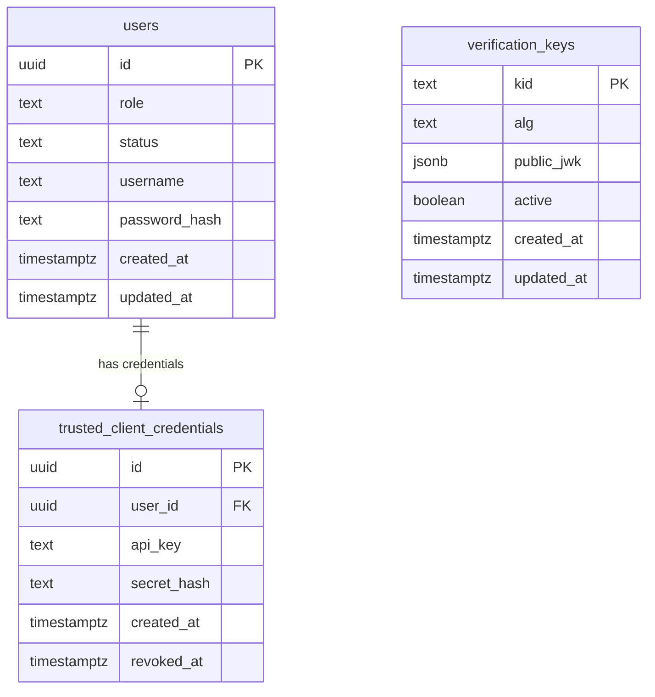
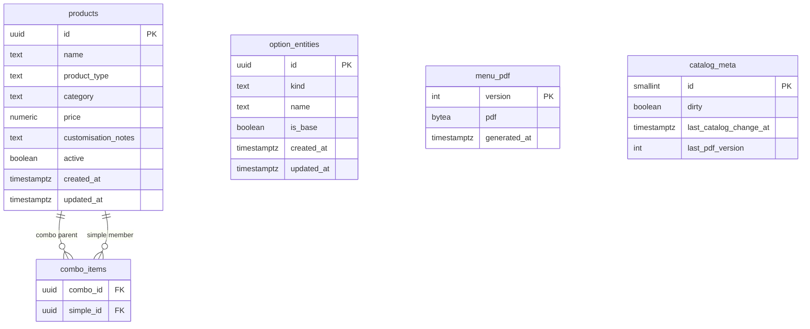
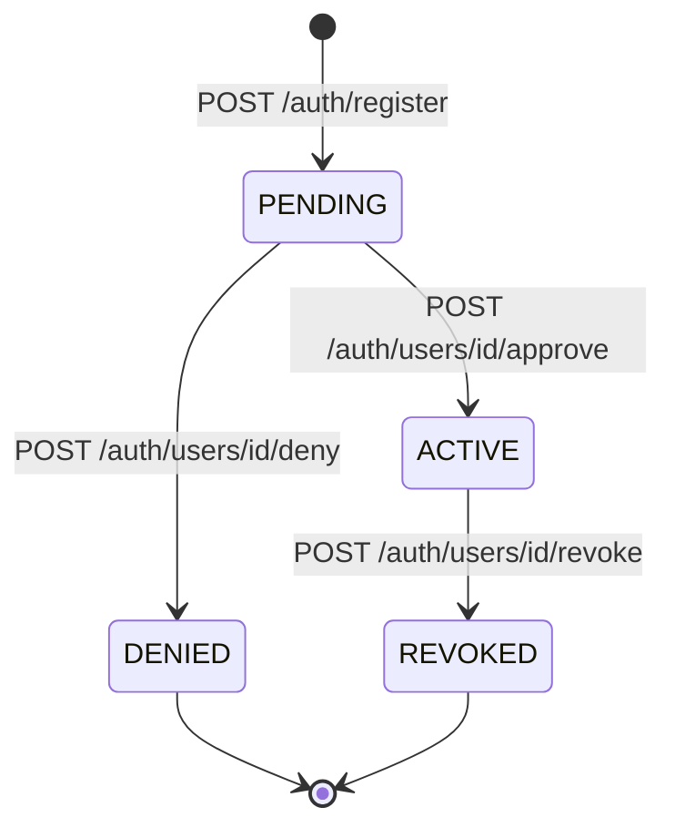
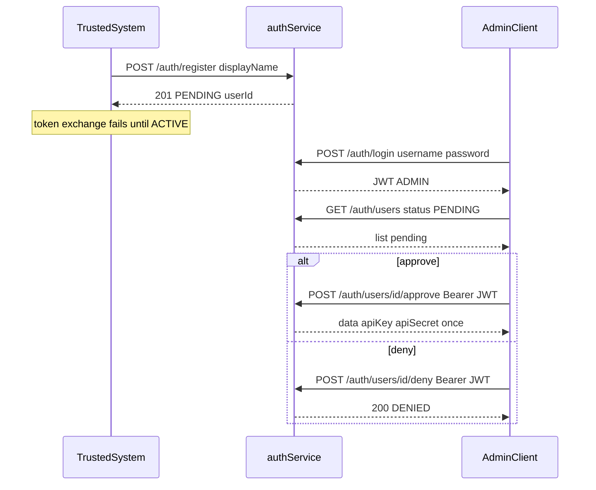
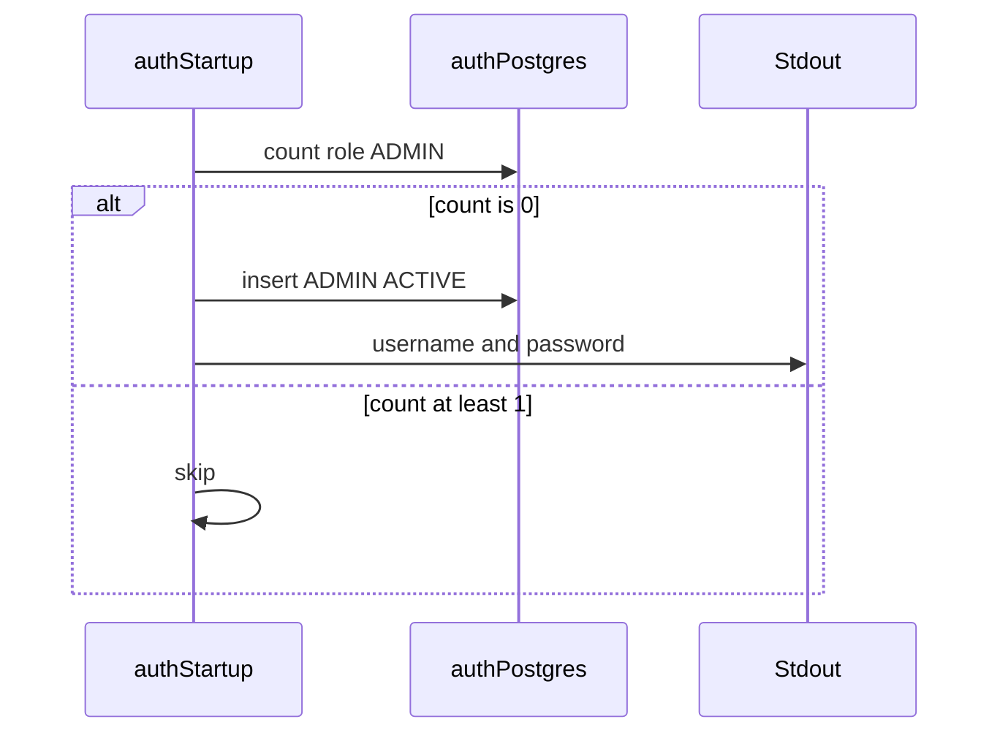
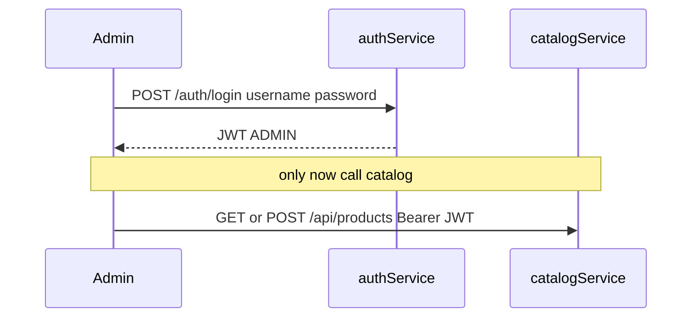
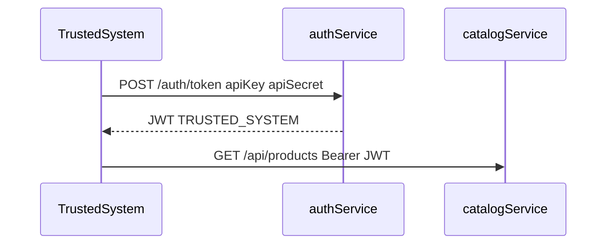
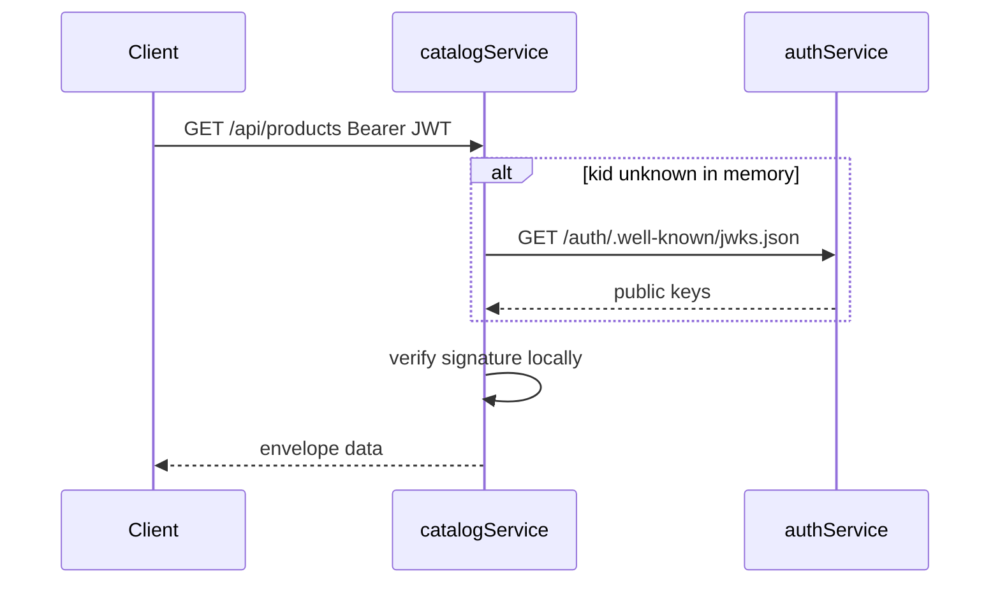
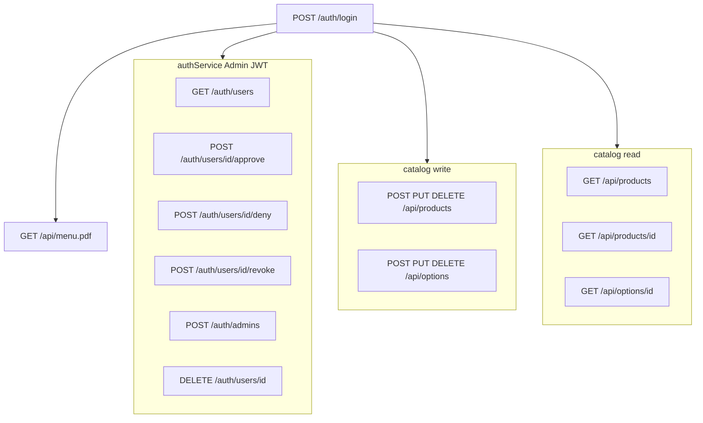

# Design / TRD — CreateYourPizza

**Status:** DRAFT — revised 2026-09-18 (owner Design Revise, pass 2). Awaiting Design gate (**Approve / Revise / Park**).

**Upstream:** [Intent](intent.md) (**APPROVED**) · [Spec / PRD](spec.md) (**APPROVED**, aligned to this Design Revise)

**Related:** [Project context](project-context.md) · [HIFL playbook](hifl-playbook.md) · [Handoff](handoff.md)

**Not in this stage:** Spring Boot scaffold, Initializr dependency lists, `AGENTS.md`, full OpenAPI YAML, or application code. Those follow Design **Approve** then Build-plan **Approve**. DTOs are **coding-time** (Spec lock); this TRD locks tables, wire JSON, and mapping rules.

---

## 1. Status and scope

This TRD translates APPROVED Intent + Spec into service boundaries, schema, API contracts, JWT/key handling, PDF job + lock, Redis, and Docker runtime.

**In scope for Design**

- Two-service architecture, **one Postgres per service**
- Redis for catalog cache, latest PDF, and **generation/write locks** (catalog only)
- Data model (tables, purpose, access patterns, ERD)
- JWT issue; catalog **local verify** via auth **JWKS HTTP** (no shared DB, no `/validate`)
- Registration / login / admin capability **flow diagrams**
- HTTP APIs, envelope, pagination, PDF history
- PDF dirty job + Redis locks (writes 503; job skips if a write is in progress)
- Docker Compose; config-property notes for Build
- OpenAPI / tests **notes** (artifacts at Build)

**Out of scope for Design**

- Application / Spring Boot implementation
- Suggested Spring Initializr dependency packaging (Build-plan / Build)
- Creating `AGENTS.md` (Build)
- Implementing customer register/login (provisioned only)

---

## 2. Architecture

Two Spring Boot + Maven applications. Owner scaffolds via Spring Initializr at **Build**. **One Postgres per service.** One Redis for catalog only.

```text
Public                 GET /api/menu.pdf[?version=N]
        |
        v
catalog-service  --R/W-->  catalog-postgres   (products, options, PDF history, dirty)
        |            --cache/lock-->  Redis   (catalog TTL, latest menu, PDF/write locks)
        |
        |   JWT local verify using public keys from memory
        |   (filled by GET /auth/.well-known/jwks.json — not auth DB)
        |
auth-service     --R/W-->  auth-postgres      (users, credentials, verification_keys)
                         private signing keys stay in auth process only
```

| Service | Database | Responsibility |
|---------|----------|----------------|
| **auth-service** | **auth-postgres** | Bootstrap first admin; trusted register/approve; admin login; `/auth/token`; JWKS publish; user admin APIs. Owns users + hashed secrets + **public** JWK rows. Private keys never leave auth. |
| **catalog-service** | **catalog-postgres** | Catalog CRUD, queries, PDF job + GET. **Never** opens auth-postgres. Verifies JWT **locally** with JWKS cached in memory. |

**Why not catalog reading `verification_keys`:** that shared-DB shortcut breaks one-DB-per-service. **Why not `/validate` on every catalog request:** it re-couples catalog availability to auth on the hot path and contradicts local JWT verify. **It is not needed.** Industry pattern: auth exposes **JWKS** (public keys only); catalog fetches and verifies signatures itself.

| Option | Use? |
|--------|------|
| Shared Postgres / catalog SELECT keys | **No** — violates one DB per service |
| `POST /auth/validate` per request | **No** — not required; extra hop; auth becomes a runtime dependency for every GET |
| **`GET /auth/.well-known/jwks.json`** + in-memory cache + lazy refetch on unknown `kid` | **Yes** — public material only; no scheduled JWKS poll (Spec: no refresh-interval product) |

**Redis:** catalog-service only (cache + latest PDF + locks). Auth does not use Redis.

**Trust boundaries:** public PDF, public trusted register, public admin login, public JWKS, public `/auth/token`. Catalog JSON = Bearer JWT + scope. Catalog never holds private keys.

---

## 3. Data model

Logical tables. Column types are indicative. Build owns Flyway/Liquibase DDL. UUID primary keys unless noted.

### 3.0 Database purpose and access patterns

Each service has its **own Postgres**. Table names below live in that service’s database (no cross-schema grants).

| Database | Purpose | Who reads | Who writes |
|----------|---------|-----------|------------|
| **auth-postgres** | Identity, roles, passwords, trusted credentials + approval/revoke, **public** JWKs | **auth-service only** (JWKS is served as HTTP, not as DB access) | **auth-service only** |
| **catalog-postgres** | Products, combo membership, option entities, PDF **history**, dirty meta | **catalog-service only** | **catalog-service only** |

**Access patterns (typical)**

| Pattern | Path |
|---------|------|
| Admin login | auth-postgres `users` by username, `ADMIN`+`ACTIVE` → JWT |
| Trusted register | Insert `TRUSTED_SYSTEM` `PENDING` + empty credentials |
| Admin approve | `ACTIVE` + generate api_key/secret; secret **once** in HTTP `data` |
| Trusted token | api_key + secret hash → JWT |
| Catalog JWKS | catalog **HTTP GET** auth JWKS → memory map by `kid` (not SQL) |
| Catalog list/get | Redis `create-your-pizza/catalog:*` (TTL from config, default 3 min) → miss → catalog-postgres → write Redis |
| Latest PDF | Redis menu key → miss → `menu_pdf` max(version) → backfill Redis |
| Historical PDF | `menu_pdf` by version — never Redis |
| Catalog write | If Redis PDF-generation lock → 503; else take write lock, mutate, set dirty, drop write lock |
| PDF job | If Redis write lock → **skip**; else take PDF lock, generate if dirty |

### 3.1 Entity relationship (visual)

Yes — ERDs stay in this TRD. Two diagrams: **auth-postgres** and **catalog-postgres**.



`verification_keys` has **no FK** to `users`. Auth writes keys and **publishes** them on JWKS. Catalog never queries this table.



`option_entities` are a shared spec catalog in v1 (no FK from `products`). `menu_pdf` is history (one row per numeric version). **No `system_status` table** — PDF vs write exclusion uses **Redis locks** (§6).

### 3.2 Database `auth-postgres`

#### `users`

| Column | Type | Notes |
|--------|------|--------|
| `id` | UUID PK | JWT `sub` |
| `role` | text | `ADMIN` \| `TRUSTED_SYSTEM`. `CUSTOMER` reserved, unused in v1 |
| `status` | text | `PENDING` \| `ACTIVE` \| `DENIED` \| `REVOKED`. Admins: `ACTIVE` (or `REVOKED` if deleted/disabled). Trusted: `PENDING` until admin approve/deny. Future CUSTOMER: `ACTIVE` on self-register (no approval) |
| `username` | text unique nullable | Admin login id. Null for trusted systems (they use `api_key`) |
| `display_name` | text nullable | Label for pending trusted requests (org/app name) |
| `password_hash` | text nullable | Admin password; null for trusted-system rows |
| `created_at` | timestamptz | |
| `updated_at` | timestamptz | |

Future CUSTOMER columns (`phone`, `name`, `email`) are **not** added in v1.

#### `trusted_client_credentials`

| Column | Type | Notes |
|--------|------|--------|
| `id` | UUID PK | |
| `user_id` | UUID FK → users unique | Role must be `TRUSTED_SYSTEM` |
| `api_key` | text unique nullable | Null until **admin approve**; then public id at `/auth/token` |
| `secret_hash` | text nullable | Null until approve; secret hashed at rest; **never** in JWT |
| `created_at` | timestamptz | |
| `revoked_at` | timestamptz nullable | Set on admin revoke |

#### `verification_keys`

Public JWK material for JWKS. **Auth-postgres only.** Catalog does not replicate this table.

| Column | Type | Notes |
|--------|------|--------|
| `kid` | text PK | JWT header `kid` |
| `alg` | text | e.g. `RS256` |
| `public_jwk` | jsonb | Public JWK JSON |
| `active` | boolean | Inactive keys kept until in-flight tokens expire |
| `created_at` | timestamptz | |
| `updated_at` | timestamptz | |

Private keys: auth-service process/config only. Never inserted here. Never sent to catalog except as **public** JWKS JSON over HTTP.

### 3.3 Database `catalog-postgres`

#### `products`

Sellable catalog. Veg/non-veg on all three types. Combo **price is admin-set**, not a sum.

| Column | Type | Notes |
|--------|------|--------|
| `id` | UUID PK | Wire `productId` |
| `name` | text | Wire `productName` |
| `product_type` | text | `simple` \| `combo` \| `pizza` (not `admin_type`) |
| `category` | text | `veg` \| `non-veg` |
| `price` | numeric(12,2) | Base/list price (Rs.); combo = admin-set |
| `customisation_notes` | text nullable | Pizza only; free-text **non-chargeable**; null for simple/combo |
| `active` | boolean | Soft-hide from consumer list if false |
| `created_at` | timestamptz | Default consumer sort |
| `updated_at` | timestamptz | |

#### `combo_items`

| Column | Type | Notes |
|--------|------|--------|
| `combo_id` | UUID FK → products | Parent `product_type = combo` |
| `simple_id` | UUID FK → products | Member `product_type = simple` |
| PK | (`combo_id`, `simple_id`) | |

Membership does **not** drive combo price.

#### `option_entities`

First-class pizza-spec catalog (not free-form strings).

| Column | Type | Notes |
|--------|------|--------|
| `id` | UUID PK | Wire `productId` on **pizza-spec** rows |
| `kind` | text | `CRUST_SIZE` \| `CRUST_TYPE` \| `TOPPING` |
| `name` | text | Display name |
| `is_base` | boolean | Seed: 10-inch size, thin crust, olive topping |
| `created_at` | timestamptz | |
| `updated_at` | timestamptz | |

Seed (Build): sizes 10 / 12 / 15 inch (10 base); types thin / cheese burst / deep dish (thin base); toppings chicken, mushrooms, pepperoni, olive (olive base).

Pizza **sellable** products (`product_type = pizza`) do not require a join to options in v1.

#### `menu_pdf` (history)

One row **per generated version**. Latest = `max(version)`. Past bytes stay in DB forever (v1: no purge).

| Column | Type | Notes |
|--------|------|--------|
| `version` | integer PK | Numeric **1, 2, 3, …** Printed on the PDF as **v1 / v2 / …** |
| `pdf` | bytea | Raw PDF bytes for that version |
| `generated_at` | timestamptz | UTC; Redis `updatedAt` for **latest** only |

#### `catalog_meta`

| Column | Type | Notes |
|--------|------|--------|
| `id` | smallint PK | Constant `1` |
| `dirty` | boolean | Set true on successful catalog mutation |
| `last_catalog_change_at` | timestamptz | |
| `last_pdf_version` | integer | Latest **generated** `menu_pdf.version` — **not** updated on product writes |

Dirty + last version live here. **Locks do not.** Do not add `generating` / `write_in_progress` columns — those would recreate `system_status` inside `catalog_meta`.

### 3.4 Consumer listing mapping

| Wire `productType` | Source |
|--------------------|--------|
| `simple` | `products` where `product_type = simple` |
| `combo` | `products` where `product_type = combo` |
| `pizza-base` | `products` where `product_type = pizza` |
| `pizza-spec` | `option_entities` (all kinds) |

**How external systems get all options:** they are **first-class rows on `GET /api/products`**, not a separate public catalog. Same JWT, same envelope, same pagination.

- All options: `GET /api/products?type=pizza-spec`
- Mixed catalog (products **and** options): `GET /api/products` with no `type` (flat union)
- One option: `GET /api/options/{id}` (also `catalog:read`)

**pizza-spec wire fields:** `productId` = option id, `productName` = option name, `productType` = `pizza-spec`, `productPrice` = `0` (not priced sellables in v1), `productCategory` = `""`, plus `optionKind` and `isBase`.

**pizza-base extra:** `customisationNotes` (string, may be empty).

Default sort: `created_at` ascending across the union. Filters take precedence.

`maxPrice` means `price < maxPrice`. Ignore `maxPrice` when `type=pizza-spec`. On an untyped list, include pizza-spec rows that satisfy `0 < maxPrice`.

Veg/non-veg applies to `products.category`. Exclude pizza-spec when `category` is set, unless `type=pizza-spec` (then category is ignored).

---

## 4. Auth, JWT, and key store

### 4.1 How principals reach catalog APIs (same JWT, different issuance)

Catalog **never** has a second handler for “admin vs trusted vs customer.” Every protected catalog call is: **Bearer JWT → local verify → scope check**.

```text
Admin (human)
  bootstrap (first start, if no ADMIN row) OR created by another admin
       → POST /auth/login  (username + password)
       → JWT  roles=ADMIN  scope=catalog:read catalog:write menu:read
       → GET/POST/PUT/DELETE catalog

Trusted / external system  (no login)
  POST /auth/register  (public; creates PENDING; no API key yet)
       → admin GET pending → approve or deny
       → on approve: api_key + api_secret issued (secret shown once)
       → POST /auth/token  (api_key + api_secret)  whenever they need a JWT
       → JWT  roles=TRUSTED_SYSTEM  scope=catalog:read menu:read
       → GET /api/products  (same routes as admin reads)

Future customer (not v1)
  self-register → ACTIVE immediately (no admin approval)
       → visible on admin user list
       → login → JWT (scopes later); admin may delete the user later
```

**Why `/auth/token` exists:** trusted systems are machines. They do not use the human login form. They exchange **long-lived API key + secret** for a **short-lived JWT** so catalog authorization stays one code path (JWT + scopes). Admin login is the human equivalent of that exchange.

**Revoke vs JWT denylist:** Admin revoke sets trusted `status=REVOKED` (and `revoked_at`). Further `/auth/token` calls fail. **Outstanding JWTs remain valid until `exp` (30m).** That is intentional and matches Spec: no live JWT denylist in v1. If a partner is compromised, revoke immediately and wait out TTL (or rotate signing keys as an operational exception).

**Last admin:** cannot delete/revoke the last remaining `ACTIVE` `ADMIN`. Additional admins are created by an existing admin (not public self-register).

### 4.2 Bootstrap first admin

On **auth-service** startup:

1. Count `users` where `role = 'ADMIN'` in **auth-postgres**.
2. If count ≥ 1 → do nothing.
3. If count = 0 → insert one `ADMIN` / `ACTIVE` with a generated username + password; **print both to the process stdout / terminal** (one-time). Operators copy them; they are not written to Redis or PDF.

Compose logs are the share path in v1. AGENTS.md (Build) will say “read auth-service logs for the first admin.”

### 4.3 Issuance and admin user APIs (auth-service)

| Method | Path | Auth | Purpose |
|--------|------|------|---------|
| `GET` | `/auth/.well-known/jwks.json` | Public | Active public JWKs (`keys` array). Catalog uses this — **not** `/validate`. |
| `POST` | `/auth/register` | Public | **Trusted system only** in v1. Does **not** create admins. Does **not** return API secret. |
| `POST` | `/auth/login` | Public | Admin username+password → JWT. Rejects non-admin and non-`ACTIVE`. |
| `POST` | `/auth/token` | Public (key+secret) | Trusted exchange → JWT. Requires `ACTIVE` + unrevoked credentials. |
| `POST` | `/auth/admins` | Admin JWT | Create another admin (username+password). |
| `GET` | `/auth/users` | Admin JWT | List users (admins, trusted, later customers). Query: `role`, `status` (e.g. `PENDING`). Paginated envelope. |
| `POST` | `/auth/users/{id}/approve` | Admin JWT | Trusted `PENDING` → `ACTIVE`; generate api_key + secret; return secret **once** in `data`. |
| `POST` | `/auth/users/{id}/deny` | Admin JWT | Trusted `PENDING` → `DENIED`. No credentials. |
| `POST` | `/auth/users/{id}/revoke` | Admin JWT | Trusted `ACTIVE` → `REVOKED`; token exchange stops. |
| `DELETE` | `/auth/users/{id}` | Admin JWT | Delete/disable another admin (not last admin). Customer delete is **later**, same route reserved. |

JWT **TTL** from config `app.jwt.ttl` (default **30 minutes**). Signing: RS256. Auth upserts the public JWK into `verification_keys` on boot/rotation and serves JWKS.

### 4.4 Binding claims (unchanged from Spec)

Header: `alg`, `kid`, `typ=JWT`.

Payload: `sub`, `iss`, `aud`, `exp`, `iat`, `scope`, `roles`, `client_id` when trusted, optional `jti`.

| Role | `scope` |
|------|---------|
| `ADMIN` | `catalog:read catalog:write menu:read` |
| `TRUSTED_SYSTEM` | `catalog:read menu:read` |

`iss` / `aud` chosen at Build. Catalog rejects mismatch.

### 4.5 Local verify (catalog-service) — JWKS, not `/validate`

1. Parse JWT; read `kid`.
2. Resolve public JWK from an **in-memory map** filled from `GET {authBase}/.well-known/jwks.json`.
3. Verify signature, `exp`, `iss`, `aud` **in catalog**.
4. Authorize: required `scope`; write routes also require `roles` contains `ADMIN`.

**Do not** call `POST /auth/validate` (v1 **does not** expose it). **Do not** query auth-postgres. Redis is not used for keys or tokens. Catalog does **not** re-check `users.status` on each request. Revoke is enforced at **token issuance**.

If auth is down, catalog can still verify tokens whose `kid` is already cached.

### 4.6 `kid` rotation (no JWKS timer)

1. Auth inserts a new `verification_keys` row and signs with that `kid`.
2. Catalog loads JWKS at **startup**.
3. Unknown `kid` → **HTTP GET JWKS again**, cache, else 401.
4. **No** scheduled refresh interval. On-demand fetch is not a poller.

### 4.7 How we know admin vs trusted at registration

**By URL, not by a public `role` field.** Public self-service must not mint `ADMIN`.

| Who | How they come into existence | HTTP |
|-----|------------------------------|------|
| First admin | Auth **startup bootstrap** if zero admins | No HTTP. Credentials to **stdout**. |
| Later admin | Existing admin creates them | `POST /auth/admins` + Admin JWT. Body: `username`, `password`. Role implied `ADMIN`. |
| Trusted system | Public application for access | `POST /auth/register` **only**. Body: `displayName` (no password, no `role`). Server forces `TRUSTED_SYSTEM` + `PENDING`. |
| Future customer | Public self-register (not v1) | Separate path later — never `/auth/register` or `/auth/admins`. |

If a client sends `role: "ADMIN"` on `/auth/register`, **ignore or 400**.

### 4.8 Registration flows (state + HTTP)

**Trusted**

```json
POST /auth/register
{ "displayName": "Partner POS" }
```

```json
201
{ "status": 201, "message": "success", "error": "", "data": { "userId": "uuid", "status": "PENDING", "role": "TRUSTED_SYSTEM" } }
```





**Admin — bootstrap then optional create** (no PENDING)



```json
POST /auth/admins
Authorization: Bearer <admin-jwt>
{ "username": "chef", "password": "..." }
```

```json
201
{ "status": 201, "message": "success", "error": "", "data": { "userId": "uuid", "role": "ADMIN", "status": "ACTIVE", "username": "chef" } }
```

### 4.9 Login / JWT issuance (before catalog)

**Admin**

```json
POST /auth/login
{ "username": "bootstrap-admin", "password": "..." }
```

```json
200
{ "status": 200, "message": "success", "error": "", "data": { "accessToken": "<jwt>", "tokenType": "Bearer", "expiresIn": 1800 } }
```



**Trusted (no login)**

```json
POST /auth/token
{ "apiKey": "...", "apiSecret": "..." }
```

Same `accessToken` envelope. 401 if not ACTIVE.



**Catalog verify — JWKS, not validate**



### 4.10 What an admin can call



Trusted JWT may use **catalog read** and **PDF** only.

---

## 5. HTTP APIs

JSON responses use the **standard envelope**. Paginated lists include `pagination` sibling. Success `error` is `""`. Public GET PDF is **raw binary**.

DTO classes are **not** specified here.

### 5.1 Envelope (locked)

```json
{
  "status": 200,
  "message": "success",
  "error": "",
  "data": {},
  "pagination": {
    "current": 1,
    "next": 2,
    "total": 10
  }
}
```

- `pagination` only on paginated JSON.
- 503 busy: `{ "status": 503, "message": "please try after sometime", "error": "system busy" }` — omit `data` and `pagination`. Header **`Retry-After: 60`**.

### 5.2 Pagination

| Rule | Value |
|------|--------|
| Default `size` | **10** |
| Max `size` | **100** (clamp; still HTTP 200) |
| `page` | 1-based |
| `pagination.next` | Next page or **-1** |
| `pagination.total` | Total matching items (products + pizza-spec in that query) |

Canonical query params: **`page` + `size`**.

### 5.3 Catalog-service — admin writes (`catalog:write` + `ADMIN`)

| Method | Path | Purpose |
|--------|------|---------|
| `POST` | `/api/products` | Create simple / combo / pizza (`productType` in body: `simple` \| `combo` \| `pizza`) |
| `PUT` | `/api/products/{id}` | Update product / price / combo membership / pizza notes |
| `DELETE` | `/api/products/{id}` | Hard delete; `combo_items` cascade |
| `POST` | `/api/options` | Create option entity |
| `PUT` | `/api/options/{id}` | Update option entity |
| `DELETE` | `/api/options/{id}` | Delete option entity |

While Redis PDF-generation lock is held → **503** + `Retry-After: 60`.

Successful mutation: take **catalog-write** Redis lock, set `catalog_meta.dirty = true`, release write lock. **Do not** delete Redis catalog keys (TTL).

### 5.4 Catalog-service — queries (`catalog:read`; Admin **or** Trusted)

Same routes for both. Trusted JWT cannot hit §5.3.

| Method | Path | Purpose |
|--------|------|---------|
| `GET` | `/api/products` | List/search including **pizza-spec options** |
| `GET` | `/api/products/{id}` | One sellable product (simple / combo / pizza-base) |
| `GET` | `/api/options/{id}` | One pizza-spec option |

**`GET /api/products` query parameters**

| Param | Meaning |
|-------|---------|
| `category` | `veg` \| `non-veg` |
| `type` | `simple` \| `combo` \| `pizza-base` \| `pizza-spec` |
| `maxPrice` | Price **under** Rs. X |
| `page` / `size` | Pagination |

Unauthenticated → 401. Wrong scope → 403.

### 5.5 Public PDF

| Method | Path | Auth | Response |
|--------|------|------|----------|
| `GET` | `/api/menu.pdf` | **None** | Raw PDF, `Content-Type: application/pdf` |

| Query | Behavior |
|-------|----------|
| *(omitted)* | **Latest** version. Redis-first; DB `max(version)` fallback; backfill Redis |
| `version` (integer ≥ 1) | That exact version. If it **is** the latest, Redis-first is allowed. If it is **historical**, **DB only**. |

Always **raw binary** (never JSON envelope) on success. Missing version or no rows yet → JSON **404** envelope.

### 5.6 Test-only PDF trigger (Build)

`POST /test/pdf/generate` — **no auth**. Enabled only when a test/dev profile is on (not production). Same lock/dirty rules as the scheduled job; it only **starts** generation immediately.

---

## 6. PDF job and Redis locks

**Content**

- Header **Create Your Pizza**
- Visible **version** as **v1 / v2 / …** matching `menu_pdf.version`
- Table rows **name + base price** for:
  - sellable products (simple, combo, pizza / pizza-base)
  - **pizza-spec option entities** (price `0` in v1)

**Cadence:** from config `app.pdf.interval` (default **5 minutes**) on catalog-service.

**Skip is not a queue.** If the job (or test trigger) sees a write in progress, it **returns immediately**. Nothing is stored to retry that run. `catalog_meta.dirty` **stays true**, so a **later** interval (or another test trigger) may generate. Missed cycles are not backfilled as extra versions.

**Version is owned by generation, not by admin writes.** A product create/update/delete sets `dirty` only. It does **not** insert `menu_pdf` or bump `last_pdf_version`. `menu_pdf.version` (printed as **vN**) increments **only** when a generation run **successfully inserts** a new history row.

**Why Redis locks, not `system_status` or extra `catalog_meta` flags:** `catalog_meta` stays dirty/version; `menu_pdf` stays bytes. Redis `SET key NX EX ttl` excludes writers vs the job and **self-heals** if `DEL` never runs (crash, kill, hang). Always `DEL` in `finally` on the happy/error path; **TTL is the safety net**.

| Redis key | When | Config | Default TTL |
|-----------|------|--------|-------------|
| `create-your-pizza/lock:pdf-generation` | Held for the duration of PDF generation | `app.lock.pdf-ttl` **MUST** exist | **120 seconds** |
| `create-your-pizza/lock:catalog-write` | Held for the duration of an admin catalog mutation | `app.lock.write-ttl` **MUST** exist | **30 seconds** |

PDF lock TTL must be **longer than a healthy generate** (so two jobs do not overlap) and **≤ `app.pdf.interval`** (default 5 min) so a dead job does not block a full extra interval after expiry. Write lock is short because a mutation is a transaction. After TTL, Redis drops the key; the next job or `POST /test/pdf/generate` can proceed.

**Job**

1. If write lock exists → **skip** (not queued). Leave `dirty` unchanged.
2. If `dirty = false` → no-op.
3. `SET` PDF lock `NX EX app.lock.pdf-ttl`. If not acquired → skip (not queued).
4. Re-check write lock; if present → `DEL` PDF lock, **skip** (not queued).
5. Generate from current products + options. Assign `version = last_pdf_version + 1` (or **1** if none).
6. **Insert** `menu_pdf`; write Redis latest menu JSON; `dirty = false`; `last_pdf_version = version`.
7. `DEL` PDF lock in `finally` (TTL still expires if this never runs).

**Admin write**

1. If PDF lock exists → **503** + `Retry-After: 60`.
2. `SET` write lock `NX EX app.lock.write-ttl`. If not acquired → **503**.
3. Persist mutation; `dirty = true`. **Do not** change `menu_pdf` / `last_pdf_version`.
4. `DEL` write lock in `finally`.

Test `POST /test/pdf/generate` uses the **same** job algorithm (skip, not queue).

---

## 7. Redis cache

Used by **catalog-service only**.

| Key | Value | Role |
|-----|--------|------|
| `create-your-pizza/menu` | JSON `{pdf, version, updatedAt}` UTC | **Latest** menu only. Redis-first / DB fallback. Overwritten by the PDF job. **No TTL required** (job replaces). Historical versions are **not** stored here. |
| `create-your-pizza/catalog:*` | Cached list/detail JSON | Redis-first / DB fallback. On DB hit, **write Redis**. **TTL** from `app.cache.catalog-ttl` (default **3 minutes**). **No** invalidation on write. |
| `create-your-pizza/lock:pdf-generation` | holder id | PDF job lock (`NX` + **`app.lock.pdf-ttl` default 120s**) |
| `create-your-pizza/lock:catalog-write` | holder id | Catalog write lock (`NX` + **`app.lock.write-ttl` default 30s**) |

**Not stored in Redis:** JWT public keys, sessions, API secrets, historical PDF bytes.

---

## 8. Docker Compose runtime

| Service | Notes |
|---------|--------|
| `auth-postgres` | Volume; auth tables only |
| `catalog-postgres` | Volume; catalog tables + sample products/options |
| `redis` | Volume; catalog cache + locks |
| `auth-service` | Depends on auth-postgres; bootstrap admin; JWKS |
| `catalog-service` | Depends on catalog-postgres + redis; `AUTH_JWKS_URL` |

**Seed:** no SQL first-admin if bootstrap is used. Sample simple/combo/pizza + option entities. `catalog_meta` dirty=true so first job can produce **v1**. **No** `system_status` seed.

---

## 9. OpenAPI and tests (notes for Build)

**OpenAPI / Swagger** — Springdoc per service; Postman-importable; document envelope, pagination, 503, PDF binary + `version` query, auth approve/revoke.

**Tests**

- Bootstrap admin only when users have zero admins
- Trusted register pending; token fails until approve; secret once on approve; deny; revoke blocks token
- Admin login JWT vs trusted token JWT hit the **same** `GET /api/products`
- Trusted cannot write
- `type=pizza-spec` returns all options; untyped list can include them
- Filters, page size 10, max 100, flat `data`, `pagination`, `next=-1`
- PDF includes **vN** and **pizza-spec** rows; latest Redis; `?version=` historical DB; unknown version 404
- Catalog verifies JWT via JWKS HTTP, never auth DB, never `/validate`
- Write during PDF lock → 503; job **skips** (not queued) if write lock held; `dirty` stays true
- PDF **version increments only on successful generation**, never on product writes
- Lock TTLs: PDF **120s**, write **30s** (`finally` DEL + Redis expiry)
- Catalog Redis TTL from config (default 3 min)
- Test `POST /test/pdf/generate` same locks, no auth, test profile only

**Build config (properties — MUST exist; defaults if generated)**

| Property | Default |
|----------|---------|
| `app.pdf.interval` | 5 minutes |
| `app.cache.catalog-ttl` | 3 minutes |
| `app.jwt.ttl` | 30 minutes |
| `app.lock.pdf-ttl` | **120 seconds** |
| `app.lock.write-ttl` | **30 seconds** |

**AGENTS.md** at Build: compose, first-admin logs, Swagger, JWKS URL.

**Stories:** before coding, write stories under `docs/stories/` per playbook (not this TRD).

---

## 10. Engineering decisions

| Topic | Decision |
|-------|----------|
| Pagination max | **100**; default **10**; clamp |
| PDF/write exclusion | **Redis locks** — not `system_status`, not flags on `catalog_meta` |
| Job vs write | Writes **503** if PDF lock; job **skips** (not queued) if write lock; `dirty` remains |
| PDF version | Increments **only** on successful generation insert — **not** on admin product writes |
| Lock TTLs | PDF **120s**, write **30s**; `finally` DEL; Redis TTL self-heal |
| `product_type` | DB `simple` \| `combo` \| `pizza` |
| pizza-base vs pizza-spec | pizza-base = `products.pizza`; pizza-spec = `option_entities` on **`GET /api/products`** |
| Admin vs trusted register | **Different endpoints** (`/auth/admins` vs `/auth/register`) |
| JWT verify | **JWKS HTTP** + memory; **no** shared DB; **no** `/validate` |
| Databases | **One Postgres per service** |
| `kid` rotation | Startup JWKS + refetch on unknown kid; no timer |
| GET PDF | Raw binary; default latest; `version` query; history in catalog DB; Redis latest only |
| Catalog Redis | TTL from config default **3 min**; Redis-first; fill on DB fetch |
| Auth bootstrap | First admin on empty admin set; stdout credentials |
| Config | PDF interval, cache TTL, JWT TTL, **lock TTLs** **must** be properties with those defaults |

---

## 11. Residual open questions

None that block coding if this TRD is Approved.

Operational (not product gates): how operators **hand the API secret** to the partner after approve (out of band — email/chat). v1 returns the secret once on the approve JSON response.

Optional later: JWT denylist on revoke; customer self-register; purge old `menu_pdf` rows.

---

## 12. Gate

Design / TRD is **DRAFT** (revised 2026-09-18, pass 2).

Please respond with one of:

- **Approve** — accept this TRD; next stage is Build plan (`docs/build-plan.md`)
- **Revise: …** — specific feedback; this file is updated, Design does not advance
- **Park** — pause Design

Do not start Build-plan or application code until Design **Approve**.
