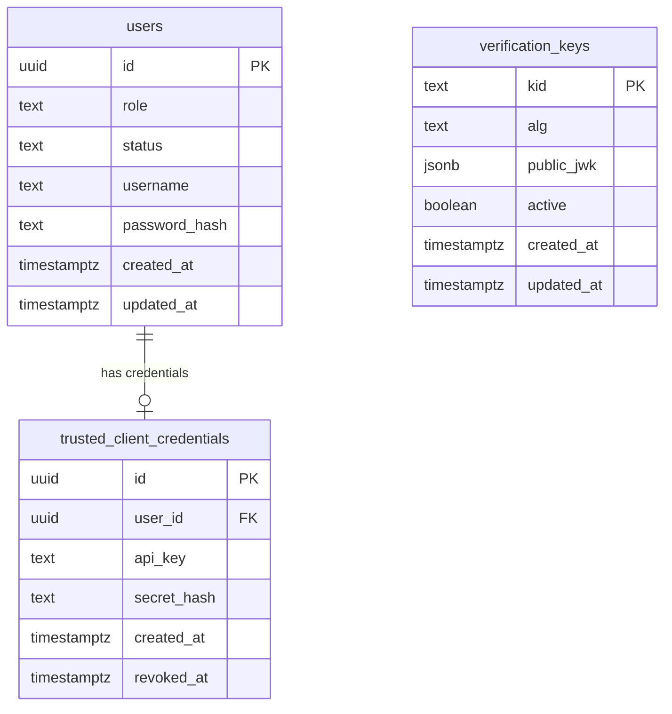
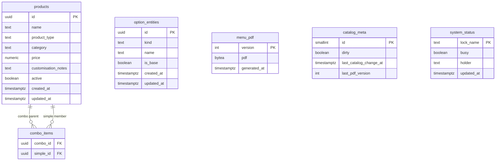

# Design / TRD — CreateYourPizza

**Status:** DRAFT — revised 2026-09-18 (owner Design Revise). Awaiting Design gate (**Approve / Revise / Park**).

**Upstream:** [Intent](intent.md) (**APPROVED**) · [Spec / PRD](spec.md) (**APPROVED**, aligned to this Design Revise)

**Related:** [Project context](project-context.md) · [HIFL playbook](hifl-playbook.md) · [Handoff](handoff.md)

**Not in this stage:** Spring Boot scaffold, Initializr dependency lists, `AGENTS.md`, full OpenAPI YAML, or application code. Those follow Design **Approve** then Build-plan **Approve**. DTOs are **coding-time** (Spec lock); this TRD locks tables, wire JSON, and mapping rules.

---

## 1. Status and scope

This TRD translates APPROVED Intent + Spec into service boundaries, schema, API contracts, JWT/key handling, PDF job + lock, Redis, and Docker runtime.

**In scope for Design**

- Two-service architecture (auth-service + catalog-service)
- Shared Postgres (+ Redis for catalog/PDF cache only)
- Data model (tables, schema purpose, access patterns, ERD)
- JWT issue/verify, DB-only public keys, `kid` rotation
- Admin vs trusted-system vs (later) customer **registration and access**
- HTTP capabilities, envelope, pagination, public PDF binary + version history
- PDF dirty/5-min job and `pdf_generation` status lock only
- Docker Compose topology
- OpenAPI / tests **notes** (artifacts at Build)

**Out of scope for Design**

- Application / Spring Boot implementation
- Suggested Spring Initializr dependency packaging (Build-plan / Build)
- Creating `AGENTS.md` (Build)
- Implementing customer register/login (provisioned only)

---

## 2. Architecture

Two Spring Boot + Maven applications. Owner scaffolds via Spring Initializr at **Build**. One Postgres instance, one Redis instance, Docker Compose bring-up.

```text
Public client          GET /api/menu.pdf[?version=N]  (raw application/pdf)
        |
        v
catalog-service  ----R/W---->  Postgres schema catalog
        |                      (products, options, PDF history, status, dirty)
        |                ----read---->  Postgres schema auth.verification_keys
        |                ----cache--->  Redis (catalog TTL + latest menu only)
        |
Admin JWT              catalog writes + same catalog reads as trusted
Trusted JWT            catalog reads only (after /auth/token)
        |
        +------------> auth-service  ----R/W---->  Postgres schema auth
                                               (users, credentials, public keys)
                                               private signing keys stay on auth only
```

| Service | Responsibility |
|---------|----------------|
| **auth-service** | Bootstrap first admin; admin login; trusted **register → pending → admin approve/deny**; trusted **API key+secret → JWT**; admin user listing and trusted **revoke** / admin delete. Owns `users` + roles, hashed secrets, **writes** public verify keys. **Private signing keys never leave auth**. |
| **catalog-service** | Product and option-entity CRUD, catalog queries, PDF job + public GET (latest or historical version). **Reads** public keys from DB and verifies JWT **locally**. **Must not** call auth per request to validate a token. |

**Shared runtime**

- **One Postgres** with two schemas: `auth` and `catalog`. Same physical database so “same user table + roles” is one table.
- **One Redis** used **only** by catalog-service (catalog cache + **latest** menu PDF). Not JWT keys, not token comparison, not historical PDFs.
- Services are independently deployable containers on the Compose network.

**Trust boundaries**

- Public: PDF GET (optional `version`); trusted **register** (pending); admin **login**.
- Auth: token exchange for **approved** trusted systems; admin user-management APIs (Admin JWT).
- Catalog JSON APIs: valid JWT + required `scope` (role as coarse gate).
- Catalog never holds private signing material.

---

## 3. Data model

Logical tables. Column types are indicative. Build owns Flyway/Liquibase DDL. UUID primary keys unless noted.

### 3.0 Schema purpose and access patterns

| Schema | Purpose | Who reads | Who writes |
|--------|---------|-----------|------------|
| **`auth`** | Identity, roles, admin passwords, trusted API credentials + approval/revoke state, JWT **public** verify keys | **auth-service:** all tables. **catalog-service:** `verification_keys` **only** (local JWT verify) | **auth-service only.** Catalog never writes `auth`. |
| **`catalog`** | Sellable products, combo membership, pizza option entities, PDF **history**, dirty flag, PDF-generation lock | **catalog-service only** | **catalog-service only.** Auth never reads or writes catalog data. |

**Access patterns (typical)**

| Pattern | Path |
|---------|------|
| Admin login | `auth.users` by `username` where `role=ADMIN` and `status=ACTIVE` → verify password → JWT |
| Trusted register | Insert `auth.users` (`TRUSTED_SYSTEM`, `PENDING`) + placeholder credentials row (no usable secret yet) |
| Admin approve trusted | Set user `ACTIVE`; generate `api_key` + secret; store `secret_hash`; return secret **once** in approve response |
| Trusted token | Lookup `api_key` → user `ACTIVE` and not revoked → verify secret hash → JWT |
| Catalog list/get | Redis `create-your-pizza/catalog:*` (TTL 3 min) → on miss Postgres `products` / `option_entities` → write Redis |
| Latest PDF | Redis `create-your-pizza/menu` → on miss latest `catalog.menu_pdf` by max `version` → backfill Redis |
| Historical PDF | `catalog.menu_pdf` **by `version` only** — never Redis |
| Catalog write | If `pdf_generation.busy` → 503; else mutate catalog + set dirty. **No** `catalog_write` lock row |

### 3.1 Entity relationship (visual)

Yes — an ERD belongs in this TRD so table FKs are reviewable without reading every column. Two diagrams: `auth` and `catalog`.



`verification_keys` has **no FK** to `users`. Auth writes keys; catalog reads them by `kid`.



`option_entities` are a **shared spec catalog** in v1 (no FK from `products`). `menu_pdf` is a **history** table (one row per numeric version). `system_status` holds a **single** lock: `pdf_generation`.

### 3.2 Schema `auth`

#### `users`

| Column | Type | Notes |
|--------|------|--------|
| `id` | UUID PK | JWT `sub` |
| `role` | text | `ADMIN` \| `TRUSTED_SYSTEM`. `CUSTOMER` reserved, unused in v1 |
| `status` | text | `PENDING` \| `ACTIVE` \| `DENIED` \| `REVOKED`. Admins: `ACTIVE` (or `REVOKED` if deleted/disabled). Trusted: `PENDING` until admin approve/deny. Future CUSTOMER: `ACTIVE` on self-register (no approval) |
| `username` | text unique nullable | Admin login id. Null for trusted systems (they use `api_key`) |
| `display_name` | text nullable | Label for pending trusted requests (org/app name) |
| `password_hash` | text nullable | Admin password; null for trusted-system rows |
| `created_at` | timestamptz | |
| `updated_at` | timestamptz | |

Future CUSTOMER columns (`phone`, `name`, `email`) are **not** added in v1.

#### `trusted_client_credentials`

| Column | Type | Notes |
|--------|------|--------|
| `id` | UUID PK | |
| `user_id` | UUID FK → users unique | Role must be `TRUSTED_SYSTEM` |
| `api_key` | text unique nullable | Null until **admin approve**; then public id at `/auth/token` |
| `secret_hash` | text nullable | Null until approve; secret hashed at rest; **never** in JWT |
| `created_at` | timestamptz | |
| `revoked_at` | timestamptz nullable | Set on admin revoke |

#### `verification_keys`

Central **public** verify material. **DB only**. Catalog reads; auth writes.

| Column | Type | Notes |
|--------|------|--------|
| `kid` | text PK | JWT header `kid` |
| `alg` | text | e.g. `RS256` |
| `public_jwk` | jsonb | Public JWK JSON |
| `active` | boolean | Inactive keys kept until in-flight tokens expire |
| `created_at` | timestamptz | |
| `updated_at` | timestamptz | |

Private keys: auth-service process/config only. Never inserted here.

### 3.3 Schema `catalog`

#### `products`

Sellable catalog. Veg/non-veg on all three types. Combo **price is admin-set**, not a sum.

| Column | Type | Notes |
|--------|------|--------|
| `id` | UUID PK | Wire `productId` |
| `name` | text | Wire `productName` |
| `product_type` | text | `simple` \| `combo` \| `pizza` (not `admin_type`) |
| `category` | text | `veg` \| `non-veg` |
| `price` | numeric(12,2) | Base/list price (Rs.); combo = admin-set |
| `customisation_notes` | text nullable | Pizza only; free-text **non-chargeable**; null for simple/combo |
| `active` | boolean | Soft-hide from consumer list if false |
| `created_at` | timestamptz | Default consumer sort |
| `updated_at` | timestamptz | |

#### `combo_items`

| Column | Type | Notes |
|--------|------|--------|
| `combo_id` | UUID FK → products | Parent `product_type = combo` |
| `simple_id` | UUID FK → products | Member `product_type = simple` |
| PK | (`combo_id`, `simple_id`) | |

Membership does **not** drive combo price.

#### `option_entities`

First-class pizza-spec catalog (not free-form strings).

| Column | Type | Notes |
|--------|------|--------|
| `id` | UUID PK | Wire `productId` on **pizza-spec** rows |
| `kind` | text | `CRUST_SIZE` \| `CRUST_TYPE` \| `TOPPING` |
| `name` | text | Display name |
| `is_base` | boolean | Seed: 10-inch size, thin crust, olive topping |
| `created_at` | timestamptz | |
| `updated_at` | timestamptz | |

Seed (Build): sizes 10 / 12 / 15 inch (10 base); types thin / cheese burst / deep dish (thin base); toppings chicken, mushrooms, pepperoni, olive (olive base).

Pizza **sellable** products (`product_type = pizza`) do not require a join to options in v1.

#### `menu_pdf` (history)

One row **per generated version**. Latest = `max(version)`. Past bytes stay in DB forever (v1: no purge).

| Column | Type | Notes |
|--------|------|--------|
| `version` | integer PK | Numeric **1, 2, 3, …** Printed on the PDF as **v1 / v2 / …** |
| `pdf` | bytea | Raw PDF bytes for that version |
| `generated_at` | timestamptz | UTC; Redis `updatedAt` for **latest** only |

#### `catalog_meta`

| Column | Type | Notes |
|--------|------|--------|
| `id` | smallint PK | Constant `1` |
| `dirty` | boolean | Set true on successful catalog mutation |
| `last_catalog_change_at` | timestamptz | |
| `last_pdf_version` | integer | Equals latest `menu_pdf.version` after a successful job |

#### `system_status`

Minimal lock table. **Only** PDF generation.

| Column | Type | Notes |
|--------|------|--------|
| `lock_name` | text PK | **`pdf_generation` only** (no `catalog_write`) |
| `busy` | boolean | |
| `holder` | text nullable | Job instance / request id |
| `updated_at` | timestamptz | |

Seed one row `pdf_generation` with `busy = false`.

### 3.4 Consumer listing mapping

| Wire `productType` | Source |
|--------------------|--------|
| `simple` | `products` where `product_type = simple` |
| `combo` | `products` where `product_type = combo` |
| `pizza-base` | `products` where `product_type = pizza` |
| `pizza-spec` | `option_entities` (all kinds) |

**How external systems get all options:** they are **first-class rows on `GET /api/products`**, not a separate public catalog. Same JWT, same envelope, same pagination.

- All options: `GET /api/products?type=pizza-spec`
- Mixed catalog (products **and** options): `GET /api/products` with no `type` (flat union)
- One option: `GET /api/options/{id}` (also `catalog:read`)

**pizza-spec wire fields:** `productId` = option id, `productName` = option name, `productType` = `pizza-spec`, `productPrice` = `0` (not priced sellables in v1), `productCategory` = `""`, plus `optionKind` and `isBase`.

**pizza-base extra:** `customisationNotes` (string, may be empty).

Default sort: `created_at` ascending across the union. Filters take precedence.

`maxPrice` means `price < maxPrice`. Ignore `maxPrice` when `type=pizza-spec`. On an untyped list, include pizza-spec rows that satisfy `0 < maxPrice`.

Veg/non-veg applies to `products.category`. Exclude pizza-spec when `category` is set, unless `type=pizza-spec` (then category is ignored).

---

## 4. Auth, JWT, and key store

### 4.1 How principals reach catalog APIs (same JWT, different issuance)

Catalog **never** has a second handler for “admin vs trusted vs customer.” Every protected catalog call is: **Bearer JWT → local verify → scope check**.

```text
Admin (human)
  bootstrap (first start, if no ADMIN row) OR created by another admin
       → POST /auth/login  (username + password)
       → JWT  roles=ADMIN  scope=catalog:read catalog:write menu:read
       → GET/POST/PUT/DELETE catalog

Trusted / external system  (no login)
  POST /auth/register  (public; creates PENDING; no API key yet)
       → admin GET pending → approve or deny
       → on approve: api_key + api_secret issued (secret shown once)
       → POST /auth/token  (api_key + api_secret)  whenever they need a JWT
       → JWT  roles=TRUSTED_SYSTEM  scope=catalog:read menu:read
       → GET /api/products  (same routes as admin reads)

Future customer (not v1)
  self-register → ACTIVE immediately (no admin approval)
       → visible on admin user list
       → login → JWT (scopes later); admin may delete the user later
```

**Why `/auth/token` exists:** trusted systems are machines. They do not use the human login form. They exchange **long-lived API key + secret** for a **short-lived JWT** so catalog authorization stays one code path (JWT + scopes). Admin login is the human equivalent of that exchange.

**Revoke vs JWT denylist:** Admin revoke sets trusted `status=REVOKED` (and `revoked_at`). Further `/auth/token` calls fail. **Outstanding JWTs remain valid until `exp` (30m).** That is intentional and matches Spec: no live JWT denylist in v1. If a partner is compromised, revoke immediately and wait out TTL (or rotate signing keys as an operational exception).

**Last admin:** cannot delete/revoke the last remaining `ACTIVE` `ADMIN`. Additional admins are created by an existing admin (not public self-register).

### 4.2 Bootstrap first admin

On **auth-service** startup:

1. `SELECT count(*) FROM auth.users WHERE role = 'ADMIN'`.
2. If count ≥ 1 → do nothing.
3. If count = 0 → insert one `ADMIN` / `ACTIVE` with a generated username + password; **print both to the process stdout / terminal** (one-time). Operators copy them; they are not written to Redis or PDF.

Compose logs are the share path in v1. AGENTS.md (Build) will say “read auth-service logs for the first admin.”

### 4.3 Issuance and admin user APIs (auth-service)

| Method | Path | Auth | Purpose |
|--------|------|------|---------|
| `POST` | `/auth/register` | Public | **Trusted system only** in v1: create `PENDING` user + empty credentials. Does **not** create admins. Does **not** return API secret. |
| `POST` | `/auth/login` | Public | Admin username+password → JWT. Rejects non-admin and non-`ACTIVE`. |
| `POST` | `/auth/token` | Public (key+secret) | Trusted exchange → JWT. Requires `ACTIVE` + unrevoked credentials. |
| `POST` | `/auth/admins` | Admin JWT | Create another admin (username+password). |
| `GET` | `/auth/users` | Admin JWT | List users (admins, trusted, later customers). Query: `role`, `status` (e.g. `PENDING`). Paginated envelope. |
| `POST` | `/auth/users/{id}/approve` | Admin JWT | Trusted `PENDING` → `ACTIVE`; generate api_key + secret; return secret **once** in `data`. |
| `POST` | `/auth/users/{id}/deny` | Admin JWT | Trusted `PENDING` → `DENIED`. No credentials. |
| `POST` | `/auth/users/{id}/revoke` | Admin JWT | Trusted `ACTIVE` → `REVOKED`; token exchange stops. |
| `DELETE` | `/auth/users/{id}` | Admin JWT | Delete/disable another admin (not last admin). Customer delete is **later**, same route reserved. |

JWT **TTL = 30 minutes**. Signing: RS256. Auth upserts the public JWK into `verification_keys` on boot/rotation.

### 4.4 Binding claims (unchanged from Spec)

Header: `alg`, `kid`, `typ=JWT`.

Payload: `sub`, `iss`, `aud`, `exp`, `iat`, `scope`, `roles`, `client_id` when trusted, optional `jti`.

| Role | `scope` |
|------|---------|
| `ADMIN` | `catalog:read catalog:write menu:read` |
| `TRUSTED_SYSTEM` | `catalog:read menu:read` |

`iss` / `aud` chosen at Build. Catalog rejects mismatch.

### 4.5 Local verify (catalog-service)

1. Parse JWT; read `kid`.
2. Resolve public JWK from memory (loaded from `auth.verification_keys` where `active = true`).
3. Verify signature, `exp`, `iss`, `aud`.
4. Authorize: required `scope`; write routes also require `roles` contains `ADMIN`.

**No HTTP call to auth-service** for validation. Redis is not used for keys or tokens. Catalog does **not** re-check `users.status` on each request (JWT until expiry). Revoke is enforced at **token issuance**.

### 4.6 `kid` rotation (no JWKS refresh interval)

1. Auth inserts a new `verification_keys` row and signs with that `kid`. Previous row can stay `active` until tokens expire.
2. Catalog loads active keys at **startup**.
3. Unknown `kid` → **lazy SELECT** from DB, cache if active, else 401.
4. No scheduled JWKS poll.

---

## 5. HTTP APIs

JSON responses use the **standard envelope**. Paginated lists include `pagination` sibling. Success `error` is `""`. Public GET PDF is **raw binary**.

DTO classes are **not** specified here.

### 5.1 Envelope (locked)

```json
{
  "status": 200,
  "message": "success",
  "error": "",
  "data": {},
  "pagination": {
    "current": 1,
    "next": 2,
    "total": 10
  }
}
```

- `pagination` only on paginated JSON.
- 503 busy: `{ "status": 503, "message": "please try after sometime", "error": "system busy" }` — omit `data` and `pagination`. Header **`Retry-After: 60`**.

### 5.2 Pagination

| Rule | Value |
|------|--------|
| Default `size` | **10** |
| Max `size` | **100** (clamp; still HTTP 200) |
| `page` | 1-based |
| `pagination.next` | Next page or **-1** |
| `pagination.total` | Total matching items (products + pizza-spec in that query) |

Canonical query params: **`page` + `size`**.

### 5.3 Catalog-service — admin writes (`catalog:write` + `ADMIN`)

| Method | Path | Purpose |
|--------|------|---------|
| `POST` | `/api/products` | Create simple / combo / pizza (`productType` in body: `simple` \| `combo` \| `pizza`) |
| `PUT` | `/api/products/{id}` | Update product / price / combo membership / pizza notes |
| `DELETE` | `/api/products/{id}` | Hard delete; `combo_items` cascade |
| `POST` | `/api/options` | Create option entity |
| `PUT` | `/api/options/{id}` | Update option entity |
| `DELETE` | `/api/options/{id}` | Delete option entity |

While `pdf_generation.busy = true` → **503** + `Retry-After: 60`.

Successful mutation: set `catalog_meta.dirty = true`. **Do not** delete Redis catalog keys (TTL 3 min). **Do not** set a catalog-write lock.

### 5.4 Catalog-service — queries (`catalog:read`; Admin **or** Trusted)

Same routes for both. Trusted JWT cannot hit §5.3.

| Method | Path | Purpose |
|--------|------|---------|
| `GET` | `/api/products` | List/search including **pizza-spec options** |
| `GET` | `/api/products/{id}` | One sellable product (simple / combo / pizza-base) |
| `GET` | `/api/options/{id}` | One pizza-spec option |

**`GET /api/products` query parameters**

| Param | Meaning |
|-------|---------|
| `category` | `veg` \| `non-veg` |
| `type` | `simple` \| `combo` \| `pizza-base` \| `pizza-spec` |
| `maxPrice` | Price **under** Rs. X |
| `page` / `size` | Pagination |

Unauthenticated → 401. Wrong scope → 403.

### 5.5 Public PDF

| Method | Path | Auth | Response |
|--------|------|------|----------|
| `GET` | `/api/menu.pdf` | **None** | Raw PDF, `Content-Type: application/pdf` |

| Query | Behavior |
|-------|----------|
| *(omitted)* | **Latest** version. Redis-first; DB `max(version)` fallback; backfill Redis |
| `version` (integer ≥ 1) | That exact version. If it **is** the latest, Redis-first is allowed. If it is **historical**, **DB only**. |

Always **raw binary** (never JSON envelope) on success. Missing version or no rows yet → JSON **404** envelope.

---

## 6. PDF job and status-table lock

**Content**

- Header **Create Your Pizza**
- Visible **version** as **v1 / v2 / …** matching `menu_pdf.version`
- Table rows **name + base price** for:
  - sellable products (simple, combo, pizza / pizza-base)
  - **pizza-spec option entities** (price `0` in v1)

**Cadence:** every **5 minutes** on catalog-service. Single Compose replica in v1.

**Algorithm** (no `catalog_write` lock)

1. Read `catalog_meta`; if `dirty = false` → no-op.
2. Set `pdf_generation` busy (`false` → `true`). If already busy → skip (defensive).
3. Generate PDF from current active products **and** option entities. `version = last_pdf_version + 1` (or 1).
4. **Insert** a new `menu_pdf` row (do not overwrite past rows). Write Redis `create-your-pizza/menu` with **this** version only (latest).
5. Set `dirty = false`, `last_pdf_version = version`, clear `pdf_generation.busy`.

**Admin write path**

1. If `pdf_generation.busy` → 503 + `Retry-After: 60`.
2. Persist mutation; set dirty. Job may run concurrently with a write **only** if busy was not set yet; next dirty cycle still regenerates. **Do not** skip the job because a catalog save is in progress.

---

## 7. Redis cache

Used by **catalog-service only**.

| Key | Value | Role |
|-----|--------|------|
| `create-your-pizza/menu` | JSON `{pdf, version, updatedAt}` UTC | **Latest** menu only. Redis-first / DB fallback. Overwritten by the PDF job. **No TTL required** (job replaces). Historical versions are **not** stored here. |
| `create-your-pizza/catalog:*` | Cached list/detail JSON (hashed query or id) | Redis-first / DB fallback. On DB hit, **write Redis**. **TTL = 3 minutes**. **No** manual invalidation on admin write. Readers may see catalog JSON up to ~3 minutes stale. |

**Not stored in Redis:** JWT public keys, sessions, API secrets, historical PDF bytes.

---

## 8. Docker Compose runtime

| Service | Notes |
|---------|--------|
| `postgres` | Volume; schemas `auth` + `catalog`; tables; catalog sample data |
| `redis` | Volume persistence |
| `auth-service` | Depends on postgres; **bootstrap admin** if none; print credentials to logs |
| `catalog-service` | Depends on postgres + redis |

**Seed (sample data)**

- Do **not** rely on SQL seed for the first admin if bootstrap is used; if Compose restarts with a volume, bootstrap no-ops.
- Sample **simple**, **combo** (combo_items), **pizza** (veg and non-veg)
- All locked option entities
- `system_status` one idle `pdf_generation` row; `catalog_meta` dirty=true so the first job can produce **v1**
- Optional **dev-only** approved trusted client: **not** required if operators use register+approve; Build may still seed one inactive pending row for tests

No application code in this stage.

---

## 9. OpenAPI and tests (notes for Build)

**OpenAPI / Swagger** — Springdoc per service; Postman-importable; document envelope, pagination, 503, PDF binary + `version` query, auth approve/revoke.

**Tests**

- Bootstrap admin only when users have zero admins
- Trusted register pending; token fails until approve; secret once on approve; deny; revoke blocks token
- Admin login JWT vs trusted token JWT hit the **same** `GET /api/products`
- Trusted cannot write
- `type=pizza-spec` returns all options; untyped list can include them
- Filters, page size 10, max 100, flat `data`, `pagination`, `next=-1`
- PDF includes **vN** and **pizza-spec** rows; latest Redis; `?version=` historical DB; unknown version 404
- Write during PDF busy → 503; **no** catalog_write skip behavior
- Catalog Redis TTL 3 min write-through; no invalidation-on-write requirement

**AGENTS.md** at Build: compose, first-admin logs, Swagger.

**Initializr deps:** Build-plan, not here.

---

## 10. Engineering decisions

| Topic | Decision |
|-------|----------|
| Pagination max | **100**; default **10**; clamp |
| Status columns | `lock_name` PK, `busy`, `holder`, `updated_at` |
| Lock names | **`pdf_generation` only** |
| 503 `Retry-After` | Header `Retry-After: 60` |
| `product_type` | DB `simple` \| `combo` \| `pizza` |
| pizza-base vs pizza-spec | pizza-base = `products.pizza`; pizza-spec = `option_entities` on **`GET /api/products`** |
| Options for trusted | Same list API; `type=pizza-spec` for all options |
| Category vs pizza-spec | Veg filter excludes specs unless `type=pizza-spec` |
| List params | `page` + `size` |
| `kid` rotation | Startup load + lazy DB lookup; no JWKS poll |
| GET PDF | Raw binary; default latest; `version` query numeric; history in DB; Redis latest only |
| PDF rows | Sellable products **and** pizza-spec; show **vN** |
| Combo delete | Hard delete; cascade combo_items |
| Key format | JWK JSON; RS256 |
| Catalog Redis | TTL **3 min**; Redis-first; fill on DB fetch; **no** invalidation on write |
| Auth bootstrap | First admin on empty admin set; stdout credentials |
| Trusted access | Register pending → admin approve → `/auth/token` → same catalog GET as admin |

---

## 11. Residual open questions

None that block coding if this TRD is Approved.

Operational (not product gates): how operators **hand the API secret** to the partner after approve (out of band — email/chat). v1 returns the secret once on the approve JSON response.

Optional later: JWT denylist on revoke; customer self-register; purge old `menu_pdf` rows.

---

## 12. Gate

Design / TRD is **DRAFT** (revised 2026-09-18).

Please respond with one of:

- **Approve** — accept this TRD; next stage is Build plan (`docs/build-plan.md`)
- **Revise: …** — specific feedback; this file is updated, Design does not advance
- **Park** — pause Design

Do not start Build-plan or application code until Design **Approve**.
