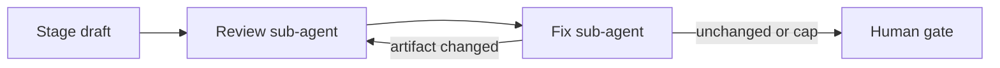
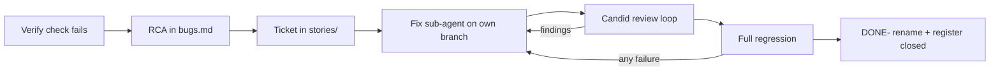

# Agentic SDLC Playbook (HIFL)

Human-in-the-Feedback-Loop (HIFL) is the control model for an agentic software development lifecycle. The human owner keeps product direction. The agent drafts artifacts and, later, implementation. This playbook is the process. It does not assume a language, a framework, a datastore, or a product.

## Purpose

HIFL keeps a human owner in control while the agent drafts artifacts and, later, implementation. Every stage produces a durable document under `docs/`. Work does not advance until the owner accepts the current stage’s artifact. This reduces rework, keeps scope honest, and makes decisions searchable in Context.

This playbook is Stage 0 (process setup). Product content starts at Stage 1 (Intent).

## Adopting this playbook

Copy this file to `docs/hifl-playbook.md` and leave it unchanged. Do not edit it to name a product, a stack, or a repository.

Do not copy another project’s `intent.md`, `spec.md`, `design.md`, `build-plan.md`, `stories/`, `bugs.md`, `verify.md`, or `handoff.md`. Those files are that project’s filled artifacts. This file is the process.

Record the following in [`docs/project-context.md`](project-context.md) and [`docs/handoff.md`](handoff.md):

- Stack, once Design and the Build plan lock it
- Owner preferences (including ask-before-commit)
- The single branch used for docs-only syncs
- What “full regression” runs, and what a fresh environment means
- Any test bar stricter than the default in [Build-stage user stories](#build-stage-user-stories-required-before-coding)

Status of each stage belongs in [`docs/handoff.md`](handoff.md), not in this playbook.

## Roles

| Role | Who | Responsibility |
|------|-----|----------------|
| **Owner (human)** | Project owner | Sets goals, answers open questions, reviews each gate, chooses Approve / Revise / Park |
| **Agent** | Coding agent(s) | Drafts stage artifacts, runs the [candid review loop](#candid-review-loop) (fresh reviewer, then fresh fix agent), incorporates feedback, implements only after Design + Build plan are approved |

The agent does not invent locked product decisions past what the owner has stated. Open ideas stay in Intent until the owner promotes them.

## Stages (1–6)

| Stage | Name | Agent drafts | Artifact path | Human gate |
|-------|------|--------------|---------------|------------|
| 1 | Intent | Problem, actors, outcomes, scope, constraints, open ideas | `docs/intent.md` | Approve / Revise / Park |
| 2 | Spec | Requirements, externally visible behavior, acceptance criteria | `docs/spec.md` | Approve / Revise / Park |
| 3 | Design | Architecture, data model, security, interfaces | `docs/design.md` | Approve / Revise / Park |
| 4 | Build plan | Tasks, order, test plan, stack confirmation | `docs/build-plan.md` | Approve / Revise / Park |
| 5 | Build | Application code per approved plan | repo (after gate) | Checkpoint reviews as agreed |
| 6 | Verify | Test evidence, demo notes, residual risks; **defect register entries** for anything that fails | `docs/verify.md` + [`docs/bugs.md`](bugs.md) | Approve / Revise / Park |

### Stage rules (each stage)

1. **Agent drafts** the artifact at the path above (or updates it after Revise).
2. **Candid review loop** runs on that draft before the owner is asked to gate it (see [Candid review loop](#candid-review-loop)).
3. **Human reviews** using the gate checklist below.
4. **Human responds** with gate language: **Approve**, **Revise: …**, or **Park**.
5. On **Approve**, status in the artifact becomes accepted; the agent **updates** [`docs/handoff.md`](handoff.md) for the **next** stage (see [Stage-end handoff](#stage-end-handoff-required)); then the next stage may start (subject to any owner hold, e.g. Design).
6. On **Revise**, feedback returns to the **owning stage**; agent updates that artifact only (not the next stage), then the candid review loop runs again before the next gate ask. At **Verify**, a Revise caused by a *failing check* is not fixed by editing `verify.md` — it routes through a bug ticket (see [Defects found at Verify](#defects-found-at-verify-bug-tickets)).
7. On **Park**, work on that stage pauses; no later stage starts; leave current `handoff.md` accurate for resume.

## Gate language

Use exactly one of:

- **Approve** — artifact is accepted; next stage may begin.
- **Revise: \<specific feedback\>** — agent revises the current stage’s artifact; do not start the next stage.
- **Park** — pause this stage; leave a short reason if useful.

Ambiguous replies (“looks ok but…”) should be clarified by the agent as Approve vs Revise before advancing.

The candid review loop does **not** Approve, Revise, or Park. “Findings: none” is not owner acceptance.

## Candid review loop

Independent sub-agents review a stage draft, then a separate sub-agent fixes only in-scope findings. Use this on **every** HIFL stage (Intent, Spec, Design, Build plan, each Build story, Verify) in **every** project that adopts this playbook.

The author of the draft must **not** be the reviewer or the fix agent. Start each as a **new** agent. Do not resume the author’s chat.

### When

- After the draft (or story implementation) is ready, **before** the human gate ask.
- On Build, **before** renaming a story to `DONE-`.
- Again after a human **Revise**, before the next gate ask.

### Review sub-agent

Prompt contains **only**:

1. The artifact under review (the stage doc, or the story file plus the diff for that story).
2. The **already accepted** prior artifacts that bind this stage (not later-stage docs).
3. An **ephemeral handoff** — scope fence written into the prompt only. Do **not** commit it, do **not** add it to `handoff.md`, and do **not** leave it in the repo.

Do **not** pass the author’s plan, the implementation chat, chosen names, or expected wording as the rubric. Do **not** say the draft is correct.

Ephemeral handoff (scope fence, not a verdict):

- Judge only this stage against the documents provided.
- Name what **later** stages own, and instruct the reviewer **not** to report that work as a finding.
- No praise. Empty findings are allowed.

The reviewer returns findings only. Each finding has a **category**, a **location** (section or file), and **why** it fails a cited rule in the provided documents.

| Category | Meaning |
|----------|---------|
| **missing implementation** | This stage’s required section, decision, or acceptance criterion is absent |
| **incorrect behavior** | The draft contradicts a locked prior artifact or this stage’s own rule |
| **test gap** | Acceptance is not testable, or a coding story’s required behaviour/coverage is missing |
| **code smell** | In-scope structure that will fail the stage’s job (not a style preference) |
| **cosmetic** | Naming, formatting, or wording that does not change behaviour or meaning |

If nothing fails, the reviewer replies `Findings: none` and nothing else.

### Fix sub-agent

A new agent. Prompt contains the categorized findings plus the **same** artifact, prior docs, and ephemeral scope fence.

- Apply **missing implementation**, **incorrect behavior**, **test gap**, and in-scope **code smell** / **cosmetic** items.
- **Drop** any finding that only asks for a later stage. Record the drop in the fix report. Do not “complete” it by writing that later stage.
- Re-check the stage’s own bar (re-read the artifact against the cited docs; for a coding story, re-run that story’s tests).

### Loop cap

Up to **3** review→fix cycles:

1. Review, then fix in-scope findings.
2. If the fix changed the artifact, review again, then fix in-scope findings from that review.
3. If the fix changed the artifact again, review a **third** time, then fix in-scope findings from that third review.
4. Stop. If findings remain, show them to the owner with the gate ask. Do not keep looping past three cycles, and do not treat a clean review as **Approve**.

If a review returns `Findings: none`, or a fix makes no artifact change, stop the loop early (do not burn remaining cycles).

### What each stage is judged against

| Stage | Reviewer may use | Do not report as missing |
|-------|------------------|--------------------------|
| Intent | Playbook stage rules and the owner’s brief | Spec behavior, design, code |
| Spec | **Approved** Intent | Design diagrams, stories, code |
| Design | **Approved** Spec (and Intent locks it still cites) | Build-plan task order, code |
| Build plan | **Approved** Design | Application code |
| Build story | That story plus the Design/Spec sections it cites, and the build plan’s test rules | Later stories on the graph; Verify’s environment run defined in the build plan |
| Verify | **Approved** Spec acceptance and the built system | New product scope |
| Bug ticket | That bug’s [register](bugs.md) entry (RCA + closure criteria) and the Spec/Design clauses it cites | New product scope; unrelated defects — those get their own register entry |

## Build-stage user stories (required before coding)

After Design **and** Build-plan **Approve**, do **not** start implementation by opening a random module. First write **user stories** under [`docs/stories/`](stories/README.md).

**Rules:**

1. One markdown file per story. Sort filenames so **dependencies and priority** are obvious (e.g. `01-project-skeleton.md`, `02-OWNER-create-skeleton.md`).
   - If the story **cannot** be `DONE-` without the human owner, insert the token **`OWNER`** after the numeric id: `{id}-OWNER-{slug}.md`.
   - When complete: `DONE-{id}-OWNER-{slug}.md` (or `DONE-{id}-{slug}.md` if there is no `OWNER` token).
   - Use `OWNER` only for owner-blocking work (for example creating an account, completing a paid signup, or issuing a secret). Not for “ask before commit”, HIFL gates, or Definition of Ready.
   - Owner-blocking tasks inside the file are prefixed **`Owner:`** on the checklist line.
2. Format: **As a [type of user], I want [goal] so that [reason].** Include **acceptance criteria**, and excerpts/links to Intent / Spec / Design (and ADRs if any).
3. Every story that involves **coding** MUST include **automated tests**: **more than 80% of lines changed by that story** and **full behaviour coverage** of that story’s acceptance criteria. The build plan may require a stricter bar. A weaker bar needs an owner decision recorded in [`docs/project-context.md`](project-context.md) before Build-plan Approve. Environment and setup work may be its own story.
4. [`docs/handoff.md`](handoff.md) records **which story file(s) are in progress**. When a story is done, **rename** the file with a `DONE-` prefix (e.g. `DONE-01-project-skeleton.md` or `DONE-02-OWNER-create-skeleton.md`) so later agents skip it. Run the [candid review loop](#candid-review-loop) on that story **before** the rename. The story graph is the scope fence: later stories are not findings.
5. Pick the next non-`DONE-` story in sort order unless the owner says otherwise.
6. **One git branch per story.** Before implementing a story, create/switch to a branch that contains **only** that story’s changes. Do not mix another story, unrelated refactors, or HIFL paperwork from a different stage onto that branch.
   - Format: `feat/<story-id>-<max-5-word-summary>`
   - `<story-id>` is the **numeric prefix only** (`02` from `02-OWNER-create-skeleton.md`). `OWNER` is a filename token, not part of the branch name.
   - `<max-5-word-summary>` is lowercase hyphenated English, **at most five words** (five hyphen-separated tokens).
   - Example: `feat/01-project-skeleton`
   - **Bug tickets** keep everything above but swap the prefix to **`fix/`**: `fix/<ticket-id>-<max-5-word-summary>`, e.g. `fix/16-repair-missed-check`. Prefix by kind of work, not by stage that found it.
   - **Ask** before commit (hard rule 8). The branch name is not permission to commit.
7. **Stories vs tasks vs ready vs gates** (Agile tracking):
   - **Story** (backlog item, own file, `DONE-` rename, own git branch): a slice that delivers user/operator value **or** an **enabler** that produces a durable repo increment and unblocks other stories (e.g. the owner creates the initial project skeleton). Enablers still use the story template; mark **Type:** enabler when the actor is the owner or the increment is infrastructure.
   - **Task** (sub-item **inside** a story): a step to finish that story (add a dependency, write a migration). Track as a `## Tasks` checklist on the story file. Owner-blocking tasks start with **`Owner:`**. **No** extra story file, **no** extra branch, **no** `DONE-` for a task. Do not rename the story `DONE-` until ACs **and** tasks (including `Owner:`) are complete.
   - **Definition of Ready** (environment, not backlog): machine and tool facts that do not produce a product increment (the language toolchain, a container runtime, an editor plugin). Track in [`docs/stories/README.md`](stories/README.md). Do **not** make these stories.
   - **HIFL gates** (Approve / Revise / Park) and “ask before commit” stay **process**, not stories or tasks.

These rules apply to every project that copies this playbook.

## Defects found at Verify (bug tickets)

Stage 6 exists to compare the built system against **approved** Spec acceptance. When a check fails, the failure is a **defect**, not new scope — the behaviour was already locked and already shipped under a `DONE-` story. Do **not** fix it inline while drafting Verify, and do **not** quietly reclassify it as a residual note or a product decision.

Every bug or deviation found at Verify goes through these steps, in order:

1. **Record the RCA in the defect register** [`docs/bugs.md`](bugs.md) — fault, root cause, evidence, blast radius, why the existing tests missed it, recommended fix, and the Spec/Design clauses breached. `verify.md` keeps only the evidence and a **link** to the register entry; it is not where analysis lives.
2. **Raise a ticket** under [`docs/stories/`](stories/README.md) using the normal story template and the next number in sequence. A bug ticket is not a special case: same template, same `## Acceptance criteria` / `## Tests` / `## Tasks` sections, same one-branch-per-ticket rule, same `DONE-` rename. The only difference is the branch prefix — **`fix/<id>-<max-5-word-summary>`** instead of `feat/`, so a defect fix is distinguishable from a feature at a glance in branch and PR lists. Mark **Type:** bug and link both directions — register entry ↔ ticket.
3. **Implement on that branch** with automated tests at **more than 80% of lines changed** by the ticket and full behaviour coverage of the ticket's criteria. The same stricter-or-weaker bar rule as coding stories applies. If the defect was invisible to the existing suite, the ticket **must** add the test that would have caught it.
4. **Candid review loop** (fresh reviewer, then fresh fix agent, cap 3) as for any story, **before** the `DONE-` rename. The bug's register entry is the scope fence.
5. **Full regression** — see below. Not the touched paths; the whole suite.
6. **Close:** rename to `DONE-…`, flip the register row to **closed** with its closing evidence, update the `verify.md` defect table row with its **fix branch** and **resolution date**, refresh the evidence and acceptance rows the regression re-ran, update [`handoff.md`](handoff.md), then re-ask the Verify gate.

### Full regression on every bug ticket completion

A bug ticket is **never** closed on a green unit test alone. Closure requires, on every bug ticket without exception:

- **Every** automated suite the build plan names for Verify, not only the suite that changed.
- The **entire** Stage 6 verification pack re-run end to end on a **fresh** environment, not a spot check of the fixed behaviour. The build plan defines the commands and what “fresh” means.
- The **specific evidence that first exposed the defect**, now passing, quoted in the register entry.
- No regression in checks that were already passing; a previously green line that goes red blocks closure.

Rationale: these defects are, by definition, ones the existing tests could not see. A narrow re-test re-uses the blind spot that let the bug ship.

### Verify stays open until the defect table is clear

`verify.md` is a **living** artifact for the duration of the stage, not a snapshot written once. It carries a single **defect table** — every bug found in this stage, one row each, in tabular form — and the stage cannot be Approved while any row is open.

| Column | Contents |
|--------|----------|
| Bug | Register id (`BUG-nn`) |
| Title | One line |
| Severity | Blocking / non-blocking against Spec acceptance |
| RCA | Link to the [`bugs.md`](bugs.md) entry — never the analysis inline |
| Ticket | Link to the ticket under `stories/` |
| **Branch** | The fix branch `fix/<id>-<…>` |
| Status | open / closed |
| **Resolved** | Date the ticket reached `DONE-` after full regression; `—` while open |

As each bug is fixed, update its row **in the same pass** as the `DONE-` rename: set status to closed, fill in the branch and resolution date, and refresh the affected evidence rows and acceptance verdicts above it from the regression re-run. Keep an open/closed tally under the table so the gate state is readable at a glance. Do not delete closed rows — the table is the stage's audit trail of what was found and when it was cleared.

The gate ask is re-issued only once the table shows no open blocking rows. Non-blocking rows may be carried to the owner with the gate ask, explicitly listed, for an Approve-with-residuals decision.

### Deviations that are not bugs

A Verify finding is a **deviation to document**, not a bug, only when the built behaviour matches an approved artifact and the mismatch is with an expectation that was never locked. Record those in `verify.md` under product decisions with the citation that authorises them. If Spec or Design is what is wrong, do not patch code — reopen the owning stage per hard rule 2.

## Hard rules

1. **No stage starts until the previous stage’s artifact is accepted** (Approve).
2. **Feedback returns to the owning stage** — Spec feedback does not rewrite Intent unless the owner says the Intent itself is wrong; then reopen Intent.
3. **No application code before Design and Build plan are both approved**, and not before **user stories** exist under `docs/stories/` (see above).
4. **Build (Stage 5) starts only after the Build-plan gate** is Approve.
5. Stack choices stay provisional until Design and the Build plan lock them. Record the lock in [`docs/project-context.md`](project-context.md) and the Build plan. Do not write the stack into this playbook.
6. Artifacts live in **`docs/`**; stage status is tracked with the project coordinator. Do not scatter decisions only in chat.
7. **Stage-end handoff required:** after every stage **Approve**, update [`docs/handoff.md`](handoff.md) before drafting the next stage: **compress** completed stages into a short past-memory section, then refresh next-stage checklist/steps. Do **not** wipe and fully rewrite from scratch. That file is the durable resume memory for the next agent — not chat, not editor rules.
8. **No git commit unless the owner confirms.** After doc or code changes, the agent **asks** whether to commit (and on which branch/message). Never assume commit.
   - **Build stories:** each story uses its own branch `feat/<story-id>-<max-5-word-summary>`; **bug tickets** use `fix/<ticket-id>-<max-5-word-summary>` (see [Build-stage user stories](#build-stage-user-stories-required-before-coding) rule 6). That branch must contain **only** that ticket’s changes.
   - **Docs-only syncs** (not a coding story): use the single branch named in [`docs/project-context.md`](project-context.md) or [`docs/handoff.md`](handoff.md). Do not invent a new branch per docs edit.
9. **Candid review loop before every human gate** and before a Build story is marked `DONE-`. Reviewer and fix agent are fresh sub-agents, not the author. The ephemeral handoff is prompt-only. The loop never replaces **Approve / Revise / Park**.
10. **Defects go through a ticket, never an inline fix.** Anything that fails a Verify check is RCA'd in [`docs/bugs.md`](bugs.md), raised as a numbered ticket under `docs/stories/` on its own `fix/<id>-<…>` branch, and closed only after the candid review loop **and** a full regression — every automated suite the build plan names for Verify, plus the entire Stage 6 verification pack on a fresh environment, including the evidence that first exposed the defect (see [Defects found at Verify](#defects-found-at-verify-bug-tickets)). A green unit test is not closure. The build plan defines the commands and what “fresh” means.

## Gate review checklist (for the human)

Before Approve / Revise / Park, check:

- [ ] Problem and actors match what you meant
- [ ] In-scope and out-of-scope match the ambition you locked
- [ ] Success criteria are testable enough for the next stage
- [ ] Open ideas are listed as pending (not silently implemented)
- [ ] Risks and unknowns you care about are called out
- [ ] Nothing in this artifact commits to work you want deferred
- [ ] Links to related docs (`project-context`, playbook, prior stage) are accurate
- [ ] For every stage after Intent, the artifact is consistent with the accepted prior artifact

Product-specific checks belong in the stage artifact, not in this playbook.

## Handoffs

| What | Where |
|------|--------|
| Process + product docs | `docs/` (this playbook, `project-context.md`, `intent.md`, `spec.md`, `handoff.md`, etc.) |
| **Resume memory for next agent** | [`docs/handoff.md`](handoff.md) — living file; **compress + update** after every stage Approve |
| Stage status / checklist | Also mirrored in `handoff.md` status table; coordinator may track separately |
| **Defects + RCA** | [`docs/bugs.md`](bugs.md) — register; each entry links to its ticket under `docs/stories/` |
| Application code | Workspace repo — **only after** Design + Build plan Approve |

### Stage-end handoff (required)

**When:** immediately after owner **Approve** for Intent, Spec, Design, Build plan, Build (ready for Verify), or Verify.

**What:** update the living [`docs/handoff.md`](handoff.md) (single path — do not invent `handoff-design.md` variants unless the owner asks). **Do not fully rewrite from a blank slate.**

**How (compress then update):**

1. If `handoff.md` already exists, **summarize** prior completed-stage material into a compact **Past stages (compressed)** section (bullets / short paragraphs — not a dump of Intent/Spec).
2. Fold the just-approved stage into that compressed memory (what was decided + pointer to the APPROVED artifact).
3. Refresh **current state**, **owner preferences**, **next-agent checklist**, **next-stage steps**, and **What NOT to do** for the upcoming stage only.
4. Keep a short **locked highlights** list (or fold into past memory) so product locks stay visible without re-reading full Spec.

**Intent:** the handoff carries **compressed memory of past stages** plus **actionable handoff for the next stage** — history stays, verbosity drops.

**Minimum structure:**

- Audience, as-of date, repo root
- Stage status table (Intent → Verify) with links
- **Past stages (compressed)** — accumulated summaries of APPROVED stages
- Owner preferences still in force (incl. ask-before-commit; Design hold if any)
- Checklist for the **next** agent only
- Steps for the next stage(s)
- Locked product highlights (short) and/or folded into past memory
- What NOT to do

**Stage → next handoff focus:**

| After Approve of | Compress that stage into past memory; focus next section on |
|------------------|--------------------------------------------------------------|
| Intent | Spec |
| Spec | Design |
| Design | Build plan |
| Build plan | Build |
| Build (ready for Verify) | Verify |
| Verify | Closeout / residual notes |

**Agent resume flow (typical):** read this playbook → read current [`handoff.md`](handoff.md) (past memory + next checklist) → open linked APPROVED artifacts only as needed → continue. Repo docs are the memory; do not rely on editor rules for HIFL handoff.

### Typical gate + handoff flow

1. Agent writes or updates a stage artifact under `docs/`.
2. Agent runs the [candid review loop](#candid-review-loop) on that artifact (ephemeral handoff only; do not commit it).
3. Agent reports paths, a short summary, and any findings still open after the loop cap. Gate ask is clear (Approve / Revise / Park). **Ask before any git commit.**
4. Owner replies with gate language.
5. On Approve: agent marks the stage accepted; **compresses past stages + updates `handoff.md` for the next stage**; asks about commit; then starts the next draft (unless owner hold applies).
6. On Revise: agent edits the same artifact, runs the candid review loop again, and re-asks the gate.
7. On Park: stop; leave `handoff.md` accurate for resume.

## Artifact set

Paths and roles only. Status of each artifact belongs in [`docs/handoff.md`](handoff.md), not in this playbook.

| Path | Role |
|------|------|
| `docs/hifl-playbook.md` | This process |
| `docs/handoff.md` | Living resume: compressed past stages + next-stage handoff |
| `docs/project-context.md` | Durable decisions and project policy (stack, docs-sync branch, regression commands, test-bar overrides) |
| `docs/intent.md` | Stage 1 Intent |
| `docs/spec.md` | Stage 2 Spec |
| `docs/design.md` | Stage 3 Design |
| `docs/build-plan.md` | Stage 4 Build plan |
| `docs/stories/` | Build-stage user stories and bug tickets (after Build-plan Approve) |
| `docs/verify.md` | Stage 6 evidence; defects link out to the register |
| `docs/bugs.md` | Defect register: RCA per bug, link to its ticket, closure criteria |
| `docs/README.md` | Index of the docs folder for this repo |
