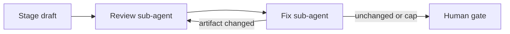

# HIFL Playbook — CreateYourPizza

Human-in-the-Feedback-Loop (HIFL) process for the CreateYourPizza pizza store catalog.

## Purpose

HIFL keeps a human owner in control of product direction while the agent drafts artifacts and, later, implementation. Every stage produces a durable document under `docs/`. Work does not advance until the owner accepts the current stage’s artifact. This reduces rework, keeps scope honest, and makes decisions searchable in Context.

This playbook is Stage 0 (process setup). Product content starts at Stage 1 (Intent).

## Roles

| Role | Who | Responsibility |
|------|-----|----------------|
| **Owner (human)** | Project owner | Sets goals, answers open questions, reviews each gate, chooses Approve / Revise / Park |
| **Agent** | Cursor agent(s) | Drafts stage artifacts, runs the [candid review loop](#candid-review-loop) (fresh reviewer, then fresh fix agent), incorporates feedback, implements only after Design + Build plan are approved |

The agent does not invent locked product decisions past what the owner has stated. Open ideas stay in Intent until the owner promotes them.

## Stages (1–6)

| Stage | Name | Agent drafts | Artifact path | Human gate |
|-------|------|--------------|---------------|------------|
| 1 | Intent | Problem, actors, outcomes, scope, constraints, open ideas | `docs/intent.md` | Approve / Revise / Park |
| 2 | Spec | Requirements, API/auth behavior, acceptance criteria | `docs/spec.md` | Approve / Revise / Park |
| 3 | Design | Architecture, data model, security, PDF/API design | `docs/design.md` | Approve / Revise / Park |
| 4 | Build plan | Tasks, order, test plan, stack confirmation | `docs/build-plan.md` | Approve / Revise / Park |
| 5 | Build | Application code per approved plan | repo (after gate) | Checkpoint reviews as agreed |
| 6 | Verify | Test evidence, demo notes, residual risks | `docs/verify.md` | Approve / Revise / Park |

### Stage rules (each stage)

1. **Agent drafts** the artifact at the path above (or updates it after Revise).
2. **Candid review loop** runs on that draft before the owner is asked to gate it (see [Candid review loop](#candid-review-loop)).
3. **Human reviews** using the gate checklist below.
4. **Human responds** with gate language: **Approve**, **Revise: …**, or **Park**.
5. On **Approve**, status in the artifact becomes accepted; the agent **updates** [`docs/handoff.md`](handoff.md) for the **next** stage (see [Stage-end handoff](#stage-end-handoff--required)); then the next stage may start (subject to any owner hold, e.g. Design).
6. On **Revise**, feedback returns to the **owning stage**; agent updates that artifact only (not the next stage), then the candid review loop runs again before the next gate ask.
7. On **Park**, work on that stage pauses; no later stage starts; leave current `handoff.md` accurate for resume.

## Gate language

Use exactly one of:

- **Approve** — artifact is accepted; next stage may begin.
- **Revise: \<specific feedback\>** — agent revises the current stage’s artifact; do not start the next stage.
- **Park** — pause this stage; leave a short reason if useful.

Ambiguous replies (“looks ok but…”) should be clarified by the agent as Approve vs Revise before advancing.

The candid review loop does **not** Approve, Revise, or Park. “Findings: none” is not owner acceptance.

## Candid review loop

Independent sub-agents review a stage draft, then a separate sub-agent fixes only in-scope findings. Use this on **every** HIFL stage (Intent, Spec, Design, Build plan, each Build story, Verify) and in **any** project that adopts this playbook. Product names below are examples; swap in that project’s artifact paths and its “later stage owns this” list.

The author of the draft must **not** be the reviewer or the fix agent. Start each as a **new** agent. Do not resume the author’s chat.

### When

- After the draft (or story implementation) is ready, **before** the human gate ask.
- On Build, **before** renaming a story to `DONE-`.
- Again after a human **Revise**, before the next gate ask.

### Review sub-agent

Prompt contains **only**:

1. The artifact under review (the stage doc, or the story file plus the diff for that story).
2. The **already accepted** prior artifacts that bind this stage (not later-stage docs).
3. An **ephemeral handoff** — scope fence written into the prompt only. Do **not** commit it, do **not** add it to `handoff.md`, and do **not** leave it in the repo.

Do **not** pass the author’s plan, the implementation chat, chosen class names, or expected wording as the rubric. Do **not** say the draft is correct.

Ephemeral handoff (scope fence, not a verdict):

- Judge only this stage against the documents provided.
- Name what **later** stages own, and instruct the reviewer **not** to report that work as a finding.
- No praise. Empty findings are allowed.

The reviewer returns findings only. Each finding has a **category**, a **location** (section or file), and **why** it fails a cited rule in the provided documents.

| Category | Meaning |
|----------|---------|
| **missing implementation** | This stage’s required section, decision, or acceptance criterion is absent |
| **incorrect behavior** | The draft contradicts a locked prior artifact or this stage’s own rule |
| **test gap** | Acceptance is not testable, or a coding story’s required behaviour/coverage is missing |
| **code smell** | In-scope structure that will fail the stage’s job (not a style preference) |
| **cosmetic** | Naming, formatting, or wording that does not change behaviour or meaning |

If nothing fails, the reviewer replies `Findings: none` and nothing else.

### Fix sub-agent

A new agent. Prompt contains the categorized findings plus the **same** artifact, prior docs, and ephemeral scope fence.

- Apply **missing implementation**, **incorrect behavior**, **test gap**, and in-scope **code smell** / **cosmetic** items.
- **Drop** any finding that only asks for a later stage. Record the drop in the fix report. Do not “complete” it by writing that later stage.
- Re-check the stage’s own bar (re-read the artifact against the cited docs; for a coding story, re-run that story’s tests).

### Loop cap

1. Review, then fix.
2. If the fix changed the artifact, review **once more**, then fix in-scope findings from that second review.
3. Stop. If findings remain, show them to the owner with the gate ask. Do not keep looping, and do not treat a clean review as **Approve**.

### What each stage is judged against

| Stage | Reviewer may use | Do not report as missing |
|-------|------------------|--------------------------|
| Intent | Playbook stage rules and the owner’s brief | Spec endpoints, design, code |
| Spec | **Approved** Intent | Design diagrams, stories, code |
| Design | **Approved** Spec (and Intent locks it still cites) | Build-plan task order, code |
| Build plan | **Approved** Design | Application code |
| Build story | That story plus the Design/Spec sections it cites, and the build plan’s test rules | Later stories on the graph; Verify’s live-stack run |
| Verify | **Approved** Spec acceptance and the built system | New product scope |

## Build-stage user stories (required before coding)

After Design **and** Build-plan **Approve**, do **not** start implementation by opening a random class. First write **user stories** under [`docs/stories/`](stories/README.md).

**Rules:**

1. One markdown file per story. Sort filenames so **dependencies and priority** are obvious (e.g. `01-env-compose.md`, `02-OWNER-maven-initializr.md`).
   - If the story **cannot** be `DONE-` without the human owner, insert the token **`OWNER`** after the numeric id: `{id}-OWNER-{slug}.md`.
   - When complete: `DONE-{id}-OWNER-{slug}.md` (or `DONE-{id}-{slug}.md` if there is no `OWNER` token).
   - Use `OWNER` only for owner-blocking work (e.g. Spring Initializr). Not for “ask before commit”, HIFL gates, or Definition of Ready.
   - Owner-blocking tasks inside the file are prefixed **`Owner:`** on the checklist line.
2. Format: **As a [type of user], I want [goal] so that [reason].** Include **acceptance criteria**, and excerpts/links to Intent / Spec / Design (and ADRs if any).
3. Every story that involves **coding** MUST include **unit tests**: **>80% LoC coverage** and **full behaviour coverage** of that story. Environment/setup work may be its own story.
4. [`docs/handoff.md`](handoff.md) records **which story file(s) are in progress**. When a story is done, **rename** the file with a `DONE-` prefix (e.g. `DONE-01-env-compose.md` or `DONE-02-OWNER-maven-initializr.md`) so later agents skip it. Run the [candid review loop](#candid-review-loop) on that story **before** the rename. The story graph is the scope fence: later stories are not findings.
5. Pick the next non-`DONE-` story in sort order unless the owner says otherwise.
6. **One git branch per story.** Before implementing a story, create/switch to a branch that contains **only** that story’s changes. Do not mix another story, unrelated refactors, or HIFL paperwork from a different stage onto that branch.
   - Format: `feat/<story-id>-<max-5-word-summary>`
   - `<story-id>` is the **numeric prefix only** (`02` from `02-OWNER-maven-initializr.md`). `OWNER` is a filename token, not part of the branch name.
   - `<max-5-word-summary>` is lowercase hyphenated English, **at most five words** (five hyphen-separated tokens).
   - Example: `feat/01-compose-and-config`
   - **Ask** before commit (hard rule 8). The branch name is not permission to commit.
7. **Stories vs tasks vs ready vs gates** (Agile tracking):
   - **Story** (backlog item, own file, `DONE-` rename, own git branch): a slice that delivers user/operator value **or** an **enabler** that produces a durable repo increment and unblocks other stories (e.g. owner Initializr). Enablers still use the story template; mark **Type:** enabler when the actor is the owner or the increment is infrastructure.
   - **Task** (sub-item **inside** a story): a step to finish that story (add Nimbus to `pom.xml`, write a Flyway file). Track as a `## Tasks` checklist on the story file. Owner-blocking tasks start with **`Owner:`**. **No** extra story file, **no** extra branch, **no** `DONE-` for a task. Do not rename the story `DONE-` until ACs **and** tasks (including `Owner:`) are complete.
   - **Definition of Ready** (environment, not backlog): machine/IDE facts that do not produce a product increment (Java 26 installed, Docker, Maven, Lombok IDE plugin). Track in [`docs/stories/README.md`](stories/README.md). Do **not** make these stories.
   - **HIFL gates** (Approve / Revise / Park) and “ask before commit” stay **process**, not stories or tasks.

This applies to any agentic SDLC using this playbook, not only CreateYourPizza.

## Hard rules

1. **No stage starts until the previous stage’s artifact is accepted** (Approve).
2. **Feedback returns to the owning stage** — Spec feedback does not rewrite Intent unless the owner says the Intent itself is wrong; then reopen Intent.
3. **No application code before Design and Build plan are both approved**, and not before **user stories** exist under `docs/stories/` (see above).
4. **Build (Stage 5) starts only after the Build-plan gate** is Approve.
5. Stack choices (e.g. Spring Boot 3) stay provisional until Design (and Build plan) lock them.
6. Artifacts live in **`docs/`**; stage status is tracked with the project coordinator. Do not scatter decisions only in chat.
7. **Stage-end handoff required:** after every stage **Approve**, update [`docs/handoff.md`](handoff.md) before drafting the next stage: **compress** completed stages into a short past-memory section, then refresh next-stage checklist/steps. Do **not** wipe and fully rewrite from scratch. That file is the durable resume memory for the next agent — not chat, not Cursor rules.
8. **No git commit unless the owner confirms.** After doc or code changes, the agent **asks** whether to commit (and on which branch/message). Never assume commit.
   - **Build stories:** each story uses its own branch `feat/<story-id>-<max-5-word-summary>` (see [Build-stage user stories](#build-stage-user-stories-required-before-coding) rule 6). That branch must contain **only** that story’s changes.
   - **HIFL / docs-only syncs** (not a coding story): preferred branch `cursor/sync-spec-prd-revise-efa1` — do not invent extra branches for those doc syncs.
9. **Candid review loop before every human gate** and before a Build story is marked `DONE-`. Reviewer and fix agent are fresh sub-agents, not the author. The ephemeral handoff is prompt-only. The loop never replaces **Approve / Revise / Park**.

## Gate review checklist (for the human)

Before Approve / Revise / Park, check:

- [ ] Problem and actors match what you meant
- [ ] In-scope / out-of-scope match v1 ambition (catalog + PDF + external API)
- [ ] Auth levels and external API-key access are correct
- [ ] Success criteria are testable enough for later Spec
- [ ] Open ideas are listed as pending (not silently implemented)
- [ ] Risks / unknowns you care about are called out
- [ ] Nothing in this artifact commits to work you want deferred
- [ ] Links to related docs (`project-context`, playbook, prior stage) are accurate

For Spec/Design/Build-plan gates, also check consistency with the accepted prior artifact.

## Handoffs in this Project

| What | Where |
|------|--------|
| Process + product docs | `docs/` (this playbook, `project-context.md`, `intent.md`, `spec.md`, `handoff.md`, etc.) |
| **Resume memory for next agent** | [`docs/handoff.md`](handoff.md) — living file; **compress + update** after every stage Approve |
| Stage status / checklist | Also mirrored in `handoff.md` status table; coordinator may track separately |
| Application code | Workspace repo — **only after** Design + Build plan Approve |

### Stage-end handoff (required)

**When:** immediately after owner **Approve** for Intent, Spec, Design, Build plan, Build (ready for Verify), or Verify.

**What:** update the living [`docs/handoff.md`](handoff.md) (single path — do not invent `handoff-design.md` variants unless the owner asks). **Do not fully rewrite from a blank slate.**

**How (compress then update):**

1. If `handoff.md` already exists, **summarize** prior completed-stage material into a compact **Past stages (compressed)** section (bullets / short paragraphs — not a dump of Intent/Spec).
2. Fold the just-approved stage into that compressed memory (what was decided + pointer to the APPROVED artifact).
3. Refresh **current state**, **owner preferences**, **next-agent checklist**, **next-stage steps**, and **What NOT to do** for the upcoming stage only.
4. Keep a short **locked highlights** list (or fold into past memory) so product locks stay visible without re-reading full Spec.

**Intent:** the handoff carries **compressed memory of past stages** plus **actionable handoff for the next stage** — history stays, verbosity drops.

**Minimum structure:**

- Audience, as-of date, repo root
- Stage status table (Intent → Verify) with links
- **Past stages (compressed)** — accumulated summaries of APPROVED stages
- Owner preferences still in force (incl. ask-before-commit; Design hold if any)
- Checklist for the **next** agent only
- Steps for the next stage(s)
- Locked product highlights (short) and/or folded into past memory
- What NOT to do

**Stage → next handoff focus:**

| After Approve of | Compress that stage into past memory; focus next section on |
|------------------|--------------------------------------------------------------|
| Intent | Spec |
| Spec | Design |
| Design | Build plan |
| Build plan | Build |
| Build (ready for Verify) | Verify |
| Verify | Closeout / residual notes |

**Agent resume flow (typical):** read this playbook → read current [`handoff.md`](handoff.md) (past memory + next checklist) → open linked APPROVED artifacts only as needed → continue. Repo docs are the memory; do not rely on Cursor rules for HIFL handoff.

### Typical gate + handoff flow

1. Agent writes or updates a stage artifact under `docs/`.
2. Agent runs the [candid review loop](#candid-review-loop) on that artifact (ephemeral handoff only; do not commit it).
3. Agent reports paths, a short summary, and any findings still open after the loop cap. Gate ask is clear (Approve / Revise / Park). **Ask before any git commit.**
4. Owner replies with gate language.
5. On Approve: agent marks the stage accepted; **compresses past stages + updates `handoff.md` for the next stage**; asks about commit; then starts the next draft (unless owner hold applies).
6. On Revise: agent edits the same artifact, runs the candid review loop again, and re-asks the gate.
7. On Park: stop; leave `handoff.md` accurate for resume.

## Related docs

- [Project context](project-context.md) — durable product decisions
- [Intent (Stage 1)](intent.md) — APPROVED
- [Spec (Stage 2)](spec.md) — APPROVED
- [Handoff](handoff.md) — living resume: compressed past + next-stage handoff
- [Stories](stories/README.md) — Build-stage user stories (after Build-plan Approve)
- [Docs index](README.md) — how to pick up mid-process
